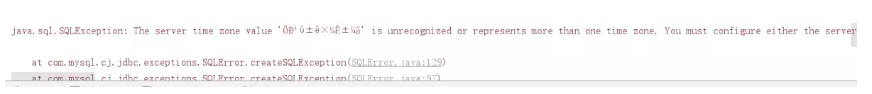
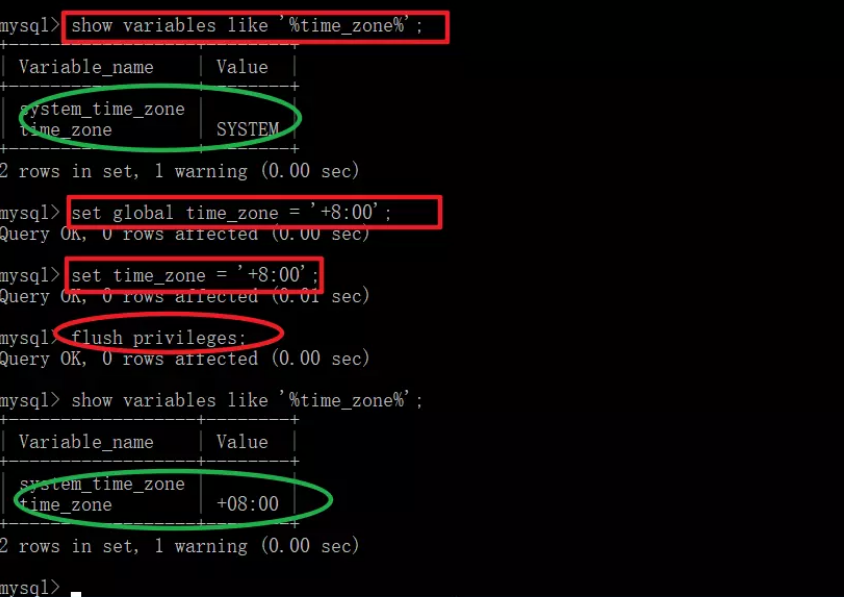
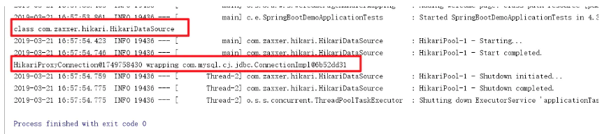
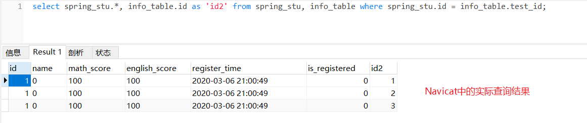
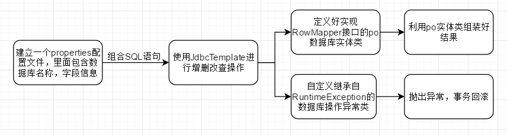

[TOC]

## 11、数据库相关配置

### 11.1、基础设置

最基础的jdbc配置如下：

参考：https://www.jianshu.com/p/e4ffdb5d81da

```properties
spring.datasource.username=root
spring.datasource.password=123456
spring.datasource.url=jdbc:mysql://127.0.0.1:3306/[数据库名称]?useUnicode=true&characterEncoding=UTF8&serverTimezone=GMT
# 如果mysql.cj.jdbc是红色的话，把pom文件mysql那里的<scope>runtime</scope>去掉即可
spring.datasource.driver-class-name=com.mysql.cj.jdbc.Driver
```

#### 注：mysql更改时区方法

在运行springboot程序时若出现了：`The server time zone value 'Öйú±ê׼ʱ¼ä' is unrecognized or represents more than one time zone`的错误



这是由于时区问题导致的, 只需要更改MySQL的时区，注意在英文状态下输入：

```
show variables like '%time_zone%'; 
set global time_zone = '+8:00';   //修改mysql全局时区为东8区，即北京时间
set time_zone = '+8:00'; //修改当前会话时区
flush privileges; //立即生效
```

效果：



这样就不会报错，springboot那边也可以输出数据源和连接了：



### 11.2、整合Druid

参考：

https://mp.weixin.qq.com/s?__biz=MzI4Njg5MDA5NA==&mid=2247484075&idx=1&sn=ca6f0f19c32eb3276a8b562888e49120&chksm=ebd743aadca0cabc934b891fdc4e116d573042f72ae87893df5c2883e46b96affac7c1923cab&scene=21###wechat_redirect

https://www.jianshu.com/p/e4ffdb5d81da

还参考了自己的springboot笔记：https://github.com/Summerki/SpringBoot_Note/blob/master/%E6%A0%B8%E5%BF%83%E6%8A%80%E6%9C%AF%E7%AF%87Note/SpringBoot.md

https://blog.csdn.net/wantnrun/article/details/94125917 （这个讲的很详细）

https://www.jianshu.com/p/0027c3d6e0df （这个也不错，讲的很详细了）

1、首先引入druid依赖

```xml
<!-- https://mvnrepository.com/artifact/com.alibaba/druid -->
<dependency>
    <groupId>com.alibaba</groupId>
    <artifactId>druid</artifactId>
    <version>1.1.19</version>
</dependency>
```

2、相关配置文件如下：

```properties
# 这里上面都是一样的
spring.datasource.username=root
spring.datasource.password=
spring.datasource.url=jdbc:mysql://127.0.0.1:3306/springboot_test?useUnicode=true&characterEncoding=UTF8&serverTimezone=GMT
spring.datasource.driver-class-name=com.mysql.cj.jdbc.Driver

# 用来自定义数据源
spring.datasource.type=com.alibaba.druid.pool.DruidDataSource

# 其他额外配置：设置完后可以看到下面的配置背景填充，这因为下边这些配置无法绑定到DataSourceProperties上，即是这些配置没有生效
# 下面为连接池的补充设置，应用到上面所有数据源中
# 初始化大小，最小，最大
spring.datasource.initialSize=5
spring.datasource.minIdle=5
spring.datasource.maxActive=20
# 配置获取连接等待超时的时间
spring.datasource.maxWait=60000
# 配置间隔多久才进行一次检测，检测需要关闭的空闲连接，单位是毫秒
spring.datasource.timeBetweenEvictionRunsMillis=60000
# 配置一个连接在池中最小生存的时间，单位是毫秒
spring.datasource.minEvictableIdleTimeMillis=300000
spring.datasource.validationQuery=SELECT 1 FROM DUAL
spring.datasource.testWhileIdle=true
spring.datasource.testOnBorrow=false
spring.datasource.testOnReturn=false
# 打开PSCache，并且指定每个连接上PSCache的大小
spring.datasource.poolPreparedStatements=true
spring.datasource.maxPoolPreparedStatementPerConnectionSize=20
# 配置监控统计拦截的filters，去掉后监控界面sql无法统计，'wall'用于防火墙
# 原来的教程是stat,wall,log4j;这会导致我们需要加上log4j的依赖，但是我们用的是slf4j，所以改成下面这个形式
spring.datasource.filters=stat,wall,slf4j,default
# 通过connectProperties属性来打开mergeSql功能；慢SQL记录
spring.datasource.connectionProperties=druid.stat.mergeSql=true;druid.stat.slowSqlMillis=5000
# 合并多个DruidDataSource的监控数据
#spring.datasource.useGlobalDataSourceStat=true
```

3、配置druid数据源状态监控，配置一个拦截器和一个Servlet即可

```java
@Configuration
public class DruidConfig {

    @ConfigurationProperties(prefix = "spring.datasource")
    @Bean
    public DruidDataSource druidDataSource(){
        return new DruidDataSource();
    }

    //配置Druid的监控
    //1、配置一个管理后台的Servlet
    @Bean
    public ServletRegistrationBean statViewServlet(){
        ServletRegistrationBean bean = new ServletRegistrationBean(new StatViewServlet(), "/druid/*");
        Map<String,String> initParams = new HashMap<>();

        initParams.put("loginUsername","admin");
        initParams.put("loginPassword","123456");
        initParams.put("allow","");//默认就是允许所有访问
        // IP黑名单 (存在共同时，deny优先于allow) : 如果满足deny的话提示:Sorry, you are not permitted to view this page.
        initParams.put("deny","192.168.15.21");

        bean.setInitParameters(initParams);
        return bean;
    }


    //2、配置一个web监控的filter
    @Bean
    public FilterRegistrationBean webStatFilter(){
        FilterRegistrationBean bean = new FilterRegistrationBean();
        bean.setFilter(new WebStatFilter());

        Map<String,String> initParams = new HashMap<>();
        //添加不需要忽略的格式信息
        initParams.put("exclusions","*.js,*.css,/druid/*");
        bean.setInitParameters(initParams);
		
        // 添加过滤信息
        bean.setUrlPatterns(Arrays.asList("/*"));

        return  bean;
    }

}
```

### 11.3、JdbcTemplate

我觉得JdbcTemplate还挺好用的~所以在脚手架里面我决定使用jdbctemplate而先不使用其他框架

---

#### 常见的Java实体类和MySQL里面的类型的对应关系

关于讲述jdbctemplate这一节，我打算用下面这个例子（`Student类`）来讲解；也为以后做项目提供一个参考：

| 字段名称              | MySQL类型    | JavaBean类型   |
| --------------------- | :----------- | :------------- |
| id（主键，自增）      | int(255)     | long           |
| name                  | varchar(255) | string         |
| math_score            | varchar(255) | string         |
| english_score         | varchar(255) | string         |
| register_time         | timestamp    | java.util.date |
| is_registered(bool值) | tinyint(1)   | int            |

---

#### 存储到MySQL后发现时间相差8个小时的解决方法

参考：https://www.cnblogs.com/zwk2018/p/9639731.html

配置`spring.datasource.url`中更改为`serverTimezone=Asia/Shanghai `

也有可能有其他的解决方法~目前这个对我来说有效

---

#### @DateTimeFormat(pattern = "yyyy:MM:dd HH:mm:ss")

参考：https://www.cnblogs.com/doit8791/p/10493722.html

这是spring中的注解，可以对`java.util.Date、java.util.Calendar、java.long.Long`等进行格式化输出

在做项目时遇到JavaBean中有关于时间的属性，就将其设置为`java.util.Date`类型并且用`@DateTimeFormat`对其进行格式化

---

#### Time、Timestamp、Date之间的转换

参考：https://www.cnblogs.com/ljllove/p/9377075.html

因为我们设计时关于时间的变量，MySQL中是采用`timestamp`，JavaBean中采用`java.util.Date`，所以这里说明下这些表示时间的类的之间的转换关系

```
1、Java中的时间类型
原理：
java.sql.Date：表示日期，年月日，没有时分秒
java.sql.Time：表示时间，年月日时分秒
java.sql.Timestamp：表示时间戳，年月日时分秒毫秒

java.util.Date：年月日时分秒，上面三个都是其子类
java.util.Calendar：目前还没用到这个

2、时间类型之间的转换
把数据库的三种时间类型赋给java.util.Date，基本不用转换，因为这是把子类对象给父类的引用，不需要转换；如：
java.sql.Date sqlDate = new java.sql.Date();
java.util.Date utilDate = sqlDate;

当需要把java.util.Date转换成数据库的三种时间类型时，这就不能直接赋值了，这需要使用数据库三种时间类型的构造器。java.sql包下的Date、Time、TimeStamp三个类的构造器都需要一个long类型的参数，表示毫秒值。创建这三个类型的对象，只需要有毫秒值即可。我们知道java.util.Date有getTime()方法可以获取毫秒值，那么这个转换也就不是什么问题了；如：
java.util.Date utilDate = new java.util.Date();
java.sql.Date sqlDate = new java.sql.Date(utilDate.getTime());
```

---

#### JdbcTemplate五大API

参考：https://blog.csdn.net/qmdweb/article/details/81224330

+ `execute`方法：可以用于执行任何SQL语句，一般用于执行DDL语句
+ `update`方法及`batchUpdate`方法：update方法用于执行新增、修改、删除等语句；batchUpdate方法用于执行批处理相关语句
+ `query`方法及`queryForXXX`方法：用于执行查询相关语句
+ `call`方法：用于执行存储过程、函数相关语句

---

#### execute方法

在我看来常用于动态创建表的生成

示例：

```java
// 创建表
public void createTable() {
    String sql = "create table test (id int(11))";
    jdbcTemplate.execute(sql);
}
```

---

#### 增加单条数据

首先我们要明确的一点是，向数据库增加数据的语句中不应该有主键，因为如果执行了两次该增加操作就会出现`主键冲突`的情况

我们使用`jdbcTemplate.update()`

```java
// 增加单条数据方法1
public void addSingle_1() {
    // 因为主键为id，所以我们不应该在插入时插入id值，因为id主键会自增
    // String sql = "insert into spring_stu (id,name,math_score,english_score,register_time,is_registered) values (?,?,?,?,?,?)";
    // 应该使用下面这个sql表达式
    String sql = "insert into spring_stu (name,math_score,english_score,register_time,is_registered) values (?,?,?,?,?)";

    int res = jdbcTemplate.update(sql, "stu1", "90", "95", new Timestamp(new Date().getTime()), 1); // sql后面的参数为sql语句里面每个`?`要填入的东西
    log.info("影响行数: {}", res);
}

// 增加单条数据方法2
public void addSingle_2() {
    String sql = "insert into spring_stu (name,math_score,english_score,register_time,is_registered) values (?,?,?,?,?)";

    Student student = new Student(1, "stu1", "90", "95", new Date(), 1); // 构造了一个Student
    // 下面这种方法可以指定每个位置插入什么元素
    int res = jdbcTemplate.update(sql, new PreparedStatementSetter() {
        @Override
        public void setValues(PreparedStatement preparedStatement) throws SQLException {
            preparedStatement.setString(1, student.getName());
            preparedStatement.setString(2, student.getMathScore());
            preparedStatement.setString(3, student.getEnglishScore());
            preparedStatement.setTimestamp(4, new Timestamp(student.getRegisterTime().getTime()));
            preparedStatement.setInt(5, student.getIsRegistered());
        }
    });

    log.info("影响行数 {}", res);
}
```

---

#### 批量增加多条数据

我们使用`jdbcTemplate.batchUpdate()`

```java
// 批量增加多条数据方法1
public void addMultiple_1() {
    String sql = "insert into spring_stu (name,math_score,english_score,register_time,is_registered) values (?,?,?,?,?)";

    List<Object[]> paramList = new ArrayList<>(); // 必须是List<Object[]>!!!
    Object[] param;
    for (int i = 0; i < 10; i++) {
        param = new Object[]{"name"+i, i, i, new Date(), 0}; // 每个Object[]里面存放对应sql的`?`的值
        paramList.add(param);
    }

    int[] res = jdbcTemplate.batchUpdate(sql, paramList);

    log.info("批量增加 方法1 {}", res); // 返回值类似于[1,1,1,..]，代表每条插入记录是否成功；1成功0失败
}

// 批量增加多条数据方法2
public void addMultiple_2() {
    String sql = "insert into spring_stu (name,math_score,english_score,register_time,is_registered) values (?,?,?,?,?)";

    // 构造一组List<Student>
    List<Student> stuList = new ArrayList<>();
    Student stu;
    for (int i = 0; i < 10; i++) {
        stu = new Student(i, "name" + i, Integer.toString(i), Integer.toString(i), new Date(), 0);
        stuList.add(stu);
    }

	// 指定sql中每个`?`对应什么含义
    int[] res = jdbcTemplate.batchUpdate(sql, new BatchPreparedStatementSetter() {
        @Override
        public void setValues(PreparedStatement preparedStatement, int i) throws SQLException {
            preparedStatement.setLong(1, stuList.get(i).getId());
            preparedStatement.setString(2, stuList.get(i).getMathScore());
            preparedStatement.setString(3, stuList.get(i).getEnglishScore());
            preparedStatement.setTimestamp(4, new Timestamp(stuList.get(i).getRegisterTime().getTime()));
            preparedStatement.setInt(5, stuList.get(i).getIsRegistered());
        }

        @Override
        public int getBatchSize() {
            return stuList.size();
        }
    });

    log.info("批量更新 方法2 {}", res);
}
```

---

#### 极大加快`批量增加多条数据`的速度

参考：https://blog.csdn.net/shushugood/article/details/81005718

其实就是在`spring.datasource.url`上面加上`rewriteBatchedStatements=true`；亲测，速度真的加快非常多！！！

值得注意的是，用了这个后批量更新返回的数组里不再是1了，而是`-2`代表成功

---

#### 删除单条数据

也是使用`jdbcTemplate.update()`；其实和`增加单条数据`的做法一样，sql换了一下而已

```java
// 删除单条数据方法1
public void deleteSingle_1() {
    String sql = "delete from spring_stu where id = ? and name = ?";
    int res = jdbcTemplate.update(sql, 3, 2); // 3和2代表sql语句的`?`要填的东西
    log.info("删除操作影响条数 {}", res);
}

// 删除单条数据方法2
public void deleteSingle_2() {
    String sql = "delete from spring_stu where id = ? and name = ?";
    int res = jdbcTemplate.update(sql, new PreparedStatementSetter() {
        @Override
        public void setValues(PreparedStatement preparedStatement) throws SQLException {
            preparedStatement.setInt(1, 2); // 指定sql语句第1个`?`位置要填的是2
            preparedStatement.setString(2, 3); // 指定sql语句第2个`?`位置要填的是3
        }
    });
    log.info("删除操作影响条数 {}", res);
}
```

---

#### 批量删除多条数据

也是使用`jdbcTemplate.batchUpdate()`；其实和`批量增加多条数据`的做法一样，sql换了一下而已

```java
// 批量删除多条数据方法1
public void deleteMultiple_1() {
    String sql = "delete from spring_stu where id = ? and name = ?";
    List<Object[]> argList = new ArrayList<>();
    Object[] arg;
    for (int i = 1; i <= 10; i++) {
        arg = new Object[]{i, i - 1};
        argList.add(arg);
    }
    int[] res = jdbcTemplate.batchUpdate(sql, argList); // argList必须是一个List<Object[]>；这是API规定的
    log.info("批量删除操作结果 {}", res);
}

public void deleteMultiple_2() {
    String sql = "delete from spring_stu where id = ? and name = ?";

    // 构造一个List<Student>
    List<Student> stuList = new ArrayList<>();
    Student stu;
    for (int i = 1; i <= 10; i++) {
        stu = new Student(i, Integer.toString(i - 1),"90", "95", new Date(), 1);
        stuList.add(stu);
    }
    
    int[] res = jdbcTemplate.batchUpdate(sql, new BatchPreparedStatementSetter() {
        @Override
        public void setValues(PreparedStatement preparedStatement, int i) throws SQLException {
            // 指定sql中每个`?`对应元素是什么
            preparedStatement.setLong(1, stuList.get(i).getId()); 
            preparedStatement.setString(2, stuList.get(i).getName());
        }

        @Override
        public int getBatchSize() {
            return stuList.size();
        }
    });

    log.info("批量删除操作结果 {}", res);
}
```

---

#### 修改单条数据

与上面同样的思路

```java
// 修改单条数据方法1
public void updateSingle_1() {
    String sql = "update spring_stu set math_score = ?, english_score = ? where id = ?";
    int res = jdbcTemplate.update(sql, "100", "100", 1);
    log.info("更新条数 {}", res);
}

// 修改单条数据方法2
public void updateSingle_2() {
    String sql = "update spring_stu set math_score = ?, english_score = ? where id = ?";
    int res = jdbcTemplate.update(sql, new PreparedStatementSetter() {
        @Override
        public void setValues(PreparedStatement preparedStatement) throws SQLException {
            preparedStatement.setString(1, "100");
            preparedStatement.setString(2, "100");
            preparedStatement.setLong(3, 2);
        }
    });
    log.info("更新条数 {}", res);
}
```

---

#### 批量修改多条数据

与上面同样的思路

```java
// 批量修改多条数据方法1
public void updateMultiple_1() {
    String sql = "update spring_stu set math_score = ?, english_score = ? where id = ?";

    List<Object[]> argList = new ArrayList<>();
    Object[] arg;
    for (int i = 1; i <= 10; i++) {
        arg = new Object[]{"100", "100", i};
        argList.add(arg);
    }
    int[] res = jdbcTemplate.batchUpdate(sql, argList); // argList必须是List<Object[]>类型
    log.info("批量更新结果 {}", res);
}

// 批量修改多条数据方法2
public void updateMultiple_2() {
    String sql = "update spring_stu set math_score = ?, english_score = ? where id = ?";

    // 准备一个List<Student>
    List<Student> stuList = new ArrayList<>();
    Student stu;
    for (int i = 1; i <= 10; i++) {
        stu = new Student();
        stu.setMathScore("100");
        stu.setEnglishScore("100");
        stu.setId(i);
        stuList.add(stu);
    }

    int[] res = jdbcTemplate.batchUpdate(sql, new BatchPreparedStatementSetter() {
        @Override
        public void setValues(PreparedStatement preparedStatement, int i) throws SQLException {
            // 设置sql语句每个`?`对应的值
            preparedStatement.setString(1, stuList.get(i).getMathScore());
            preparedStatement.setString(2, stuList.get(i).getEnglishScore());
            preparedStatement.setLong(3, stuList.get(i).getId());
        }

        @Override
        public int getBatchSize() {
            return stuList.size(); // 这里表示了Batch的size，不能返回0！！！
        }
    });

    log.info("批量更新结果 {}", res);
}
```

---

#### 查询数据操作

参考：

https://my.oschina.net/u/3480797/blog/3020706 （重要！！！教你RowMapper接口的使用）

https://www.jianshu.com/p/be60a81e2fe7 （重要）

https://blog.csdn.net/qmdweb/article/details/81224330 （重要）

https://www.jianshu.com/p/f0cbed671897

https://blog.csdn.net/jiahao1186/article/details/91413037

https://blog.csdn.net/wangzhiguo9261/article/details/79711916

https://blog.csdn.net/u013468917/article/details/52217954

---

下面给出查询数据库的几个常用方法的返回值和使用场景：

1、`query()`：一次查询多个结果，当然里面也可以只包含一个结果；可以返回`List<T>`或`T`

2、`queryForList()`： 该方法将返回一个List，该List中的每一条记录是一个Map对象，对应应数据库中某一行；而该Map 中的每一项对应该数据库行中的某一列值；可以返回`List<T>`或`List<Map<String, Object>>`

3、`queryForMap()`：查询**一行数据**并将该行数据转换为Map返回；返回`Map<String, Object>`；**经过测试，该方法也只适合于查询一条数据的情况，如果数据库中没有这条数据或者数据库中这条数据有相同的那么会抛出此异常！！！**

4、`queryForObject()`：返回`T`类型；**注意，该方法只能查询一条数据，如果数据库中没有这条数据或者数据库中这条数据有相同的那么会抛出此异常！！！**

---

`预编译语句设值回调`使用：（在前面的增删改操作中经常用到）

1、`PreparedStatementSetter`：通过回调获取JdbcTemplate提供的`PreparedStatement`，由用户来对相应的预编译语句相应参数设值

2、`BatchPreparedStatementSetter`：类似于`PreparedStatementSetter`，但用于批处理，需要指定批处理大小

---

`结果集处理回调`的方法非常有用，可以让我们从`结果集(ResultSet)`里面拿到对应的数据做出想要的修改。`结果集处理回调`有下面几种常用接口：

1、`RowMapper<T>`：`RowMapper接口`提供`mapRow(ResultSet rs, int rowNum)`方法将结果集的每一行转换为对应的类型`T`；`T`可以是Map、po对象、list等等都可以

2、`RowCallbackHandler`：`RowCallbackHandler接口`也提供方法`processRow(ResultSet rs)`，能将结果集的每一行转换为需要的形式

3、`ResultSetExtractor`：`ResultSetExtractor`使用回调方法`extractData(ResultSet rs)`提供给用户**`整个`**结果集，让用户决定如何处理该结果集

---

我们在设计po对象（也就是数据库字段对应的对象时），应该让其实现`RowMapper<T>`接口，这样以后使用JdbcTemplate操作数据库时使用到该po对象会变得容易一点，下面是例子：

```java
// po对象
@Data
@ToString
@NoArgsConstructor
@AllArgsConstructor
public class Student implements RowMapper<Student> { // po对象应当继承RowMapper<T>

    private long id;
    private String name;
    private String mathScore;
    private String englishScore;

    @DateTimeFormat(pattern = "yyyy:MM:dd hh:mm:ss")
    private Timestamp registerTime;

    private int isRegistered;
	
    // 重写mapRow()方法，将resultSet结果集和po对象的属性对应起来
    @Override
    public Student mapRow(ResultSet resultSet, int i) throws SQLException {
        Student student = new Student();
        student.setId(resultSet.getInt("id"));
        student.setName(resultSet.getString("name"));
        student.setMathScore(resultSet.getString("math_score"));
        student.setEnglishScore(resultSet.getString("english_score"));
        student.setRegisterTime(resultSet.getTimestamp("register_time"));
        student.setIsRegistered(resultSet.getInt("is_registered"));
        return student;
    }
}

// DAO层操作方法示例
public void querySingle() {
    String sql = "select * from spring_stu where id = ?";

    Student stu = jdbcTemplate.queryForObject(sql, new Object[]{"1"}, new Student()); // queryForObject()适合于返回单一值或对象
    // 返回：查询单个对象 Student(id=1, name=0, mathScore=100, englishScore=100, registerTime=2020-03-06 21:00:49.0, isRegistered=0)
    log.info("查询单个对象 {}", stu);

    List<Student> stuList = jdbcTemplate.query(sql, new Object[]{"1"}, new Student()); // query()返回集合
    // 返回：查询对象集合 [Student(id=1, name=0, mathScore=100, englishScore=100, registerTime=2020-03-06 21:00:49.0, isRegistered=0)]
    log.info("查询对象集合 {}", stuList);

    Map<String, Object> stuMap = jdbcTemplate.queryForMap(sql, "1"); // queryForMap()返回单一对象的Map
    // 返回：查询对象Map {id=1, name=0, math_score=100, english_score=100, register_time=2020-03-06 21:00:49.0, is_registered=false}
    log.info("查询对象Map {}", stuMap);

    List<Map<String, Object>> stuMapList = jdbcTemplate.queryForList(sql, "1"); // queryForList()返回List<Map<String, Object>>
    // 返回：查询对象Map的List [{id=1, name=0, math_score=100, english_score=100, register_time=2020-03-06 21:00:49.0, is_registered=false}]
    log.info("查询对象Map的List {}", stuMapList);
}
```

---

那如果你的po对象没有实现`RowMapper<T>`接口呢？那么就要用到上面讲的`结果集处理回调`的三个API了，示例如下：

```java
public void queryM() {
    String sql = "select * from spring_stu where math_score = ?";
    
	// RowMapper里面提供的是每一行结果的对应关系！！！
    // RowMapper里面可以放xxx，最后返回结果是List<xxx>
    List<Student> stuList = jdbcTemplate.query(sql, new RowMapper<Student>() {
        @Override
        public Student mapRow(ResultSet resultSet, int i) throws SQLException { // resultSet对应每一行的数据
            Student stu = new Student();
            stu.setId(resultSet.getLong("id"));
            stu.setName(resultSet.getString("name"));
            stu.setMathScore(resultSet.getString("math_score"));
            stu.setEnglishScore(resultSet.getString("english_score"));
            stu.setRegisterTime(resultSet.getTimestamp("register_time"));
            stu.setIsRegistered(resultSet.getInt("is_registered"));
            return stu;
        }
    }, "100"); // "100"对应sql语句里的`?`
    log.info("RowMapper结果 {}", stuList);


	// 采用RowCallbackHandler貌似没有返回值，所以我们需要在外部设置一个盛放数据的容器
    List<Student> stuList2 = new ArrayList<>();
    // 通过PreparedStatementSetter方式给sql语句的每个`?`处设值
    jdbcTemplate.query(sql, new PreparedStatementSetter() {
        @Override
        public void setValues(PreparedStatement preparedStatement) throws SQLException {
            preparedStatement.setString(1, "100");
        }
    }, new RowCallbackHandler() {
        @Override
        public void processRow(ResultSet resultSet) throws SQLException { // resultSet对应每一行的数据
            Student stu = new Student();
            stu.setId(resultSet.getLong("id"));
            stu.setName(resultSet.getString("name"));
            stu.setMathScore(resultSet.getString("math_score"));
            stu.setEnglishScore(resultSet.getString("english_score"));
            stu.setRegisterTime(resultSet.getTimestamp("register_time"));
            stu.setIsRegistered(resultSet.getInt("is_registered"));
            stuList2.add(stu);
        }
    });
    log.info("RowCallbackHandler结果 {}", stuList2);

	
    // ResultSetExtractor处理的是整个结果集！！！与上面两个不同
    List<Student> stuList3 = jdbcTemplate.query(sql, new PreparedStatementSetter() {
        @Override
        public void setValues(PreparedStatement preparedStatement) throws SQLException {
            preparedStatement.setString(1, "100");
        }
    }, new ResultSetExtractor<List<Student>>() {
        @Override
        public List<Student> extractData(ResultSet resultSet) throws SQLException, DataAccessException { // resultSet这里代表整个结果集
            List<Student> stuList = new ArrayList<>();
            Student stu;
            while (resultSet.next()) { // 所以这里要这样用
                stu = new Student();
                stu.setId(resultSet.getLong("id"));
                stu.setName(resultSet.getString("name"));
                stu.setMathScore(resultSet.getString("math_score"));
                stu.setEnglishScore(resultSet.getString("english_score"));
                stu.setRegisterTime(resultSet.getTimestamp("register_time"));
                stu.setIsRegistered(resultSet.getInt("is_registered"));
                stuList.add(stu);
            }
            return stuList;
        }
    });
    log.info("ResultSetExtractor结果 {}", stuList3);
}
```

还有很多API没讲到，利用上面的经验和IDEA的`Ctrl+P`可以知道该怎么用

---

另外再说一个`queryForObject()`的操作，如果你查询的结果只有一个字段一个结果，那么利用`queryForObject()`方法可以很容易获取到结果。它可以返回比如Integer、Long等类型，主要利用`JdbcTemplate.queryForObject(String sql, Class<T> requiredType, @Nullable Object... args)`这个API可以返回一个你想要的类型（`requiredType`），下面看一个统计某个表的行数的例子：

```java
public void forObject() {
    String sql = "select count(*) from spring_stu";
    Integer res = jdbcTemplate.queryForObject(sql, Integer.class, new Object[]{}); // 直接返回Integer
    log.info("查询结果 {}", res);
}
```

---

#### 多表查询操作

参考：https://blog.csdn.net/fall10/article/details/84902958?depth_1-utm_source=distribute.pc_relevant.none-task&utm_source=distribute.pc_relevant.none-task

多表联合查询利用上面的`结果集处理回调`的三个API就很好办了

我的做法是先在`Navicat`里面模拟sql语句确定会返回什么结果，再利用`结果集处理回调`的三个API即可完成组装数据

当然在此期间你得会`mysql多表联合查询`以及`mysql查询结果起别名`的方法，因为要是两个表里面都是`id`字段就不好区分了

例如sql语句：

```
select spring_stu.id as 'id1', info_table.id as 'id2' from spring_stu, info_table where spring_stu.id = info_table.test_id;
// spring_stu,info_table是两个表
// as关键字起别名
// where后面跟条件
```

实际查询例子：

```java
// 多表联合查询
public void joinSearch() {
    // spring_stu.*代表需要spring_stu的所有字段
    String sql = "select spring_stu.*, info_table.id as 'id2' from spring_stu, info_table where spring_stu.id = info_table.test_id";
	
    // new Object[]{}代表该sql语句不需要参数，传入一个空Object[]即可
    List<Map<String, Object>> res = jdbcTemplate.query(sql, new Object[]{}, new RowMapper<Map<String, Object>>() {
        @Override
        public Map<String, Object> mapRow(ResultSet resultSet, int i) throws SQLException {
            Map<String, Object> map = new HashMap<>();
            map.put("id", resultSet.getLong("id"));
            map.put("name", resultSet.getString("name"));
            map.put("math_socre", resultSet.getString("math_score"));
            map.put("register_time", resultSet.getTimestamp("register_time"));
            map.put("id2", resultSet.getLong("id2"));
            return map;
        }
    });
    log.info("多表查询结果示例 {}", res);
}
```

springboot输出结果：

```
多表查询结果示例 [{id2=1, name=0, id=1, math_socre=100, register_time=2020-03-06 21:00:49.0}, {id2=2, name=0, id=1, math_socre=100, register_time=2020-03-06 21:00:49.0}, {id2=3, name=0, id=1, math_socre=100, register_time=2020-03-06 21:00:49.0}]
```



#### MySQL删除数据库的所有数据

参考：https://blog.csdn.net/weixin_38927240/article/details/80434332

`delete from [表名]`：主键会从删除的最后一个主键开始递增

`truncate table [表名]`：之后主键从1开始递增（推荐用这个）

#### MySQL查询数据库总行数

`select count(*) from [表名]`

### 11.4、事务

参考：https://www.cnblogs.com/harrychinese/p/SpringBoot_jdbc_transaction.html

事务`@Transactional`注解常用于`增删改`操作上

注意几点：

1、`@Transactional`必须放到public方法上

2、`RuntimeException`和自定义继承了`RuntimeException`的类可以用`@Transactional`回滚

3、`非RuntimeException`事务不会回滚，除非使用`@Transactional(rollbackFor=非RuntimeException.class)`，抛出`非RuntimeException`异常, 并设置了`rollbackFor`参数, 事务能回滚

---

所以我推荐的做法是，自己写一个继承自`RuntimeException`的数据库异常类，在数据库的增删改操作上加上`try-catch`语句，抛出自定义的数据库异常，并且在这些方法上加上`@Transactional`注解即可

### 11.5、常用套路

