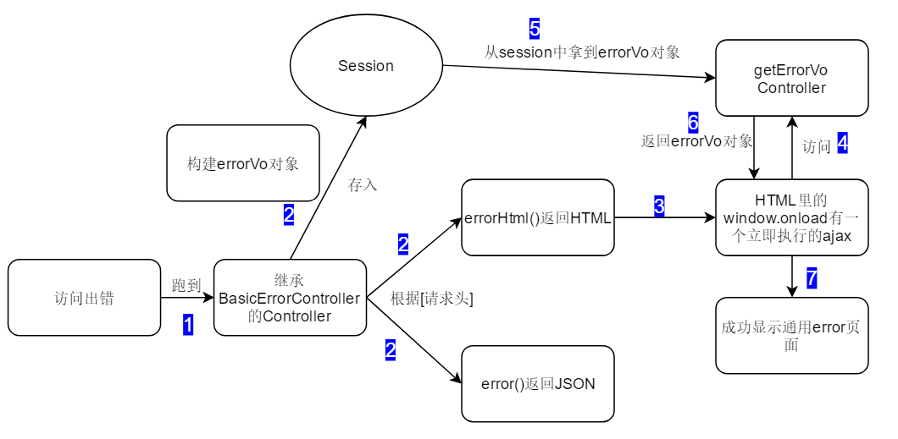
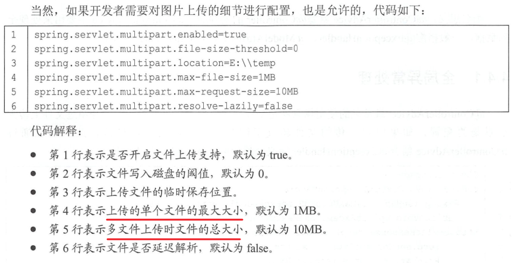

[TOC]

> 自用SpringBoot脚手架，很简单的一个脚手架，自己开发时可以省去很多麻烦
>
> 就叫SpringBoot-Cli吧
>
> 本Note存储有关搭建SpringBoot-Cli时的笔记

## 1、SpringBoot版本

该`SpringBoot-Cli`基于SpringBoot`2.2.5`版本

需要更改SpringBoot版本请修改`pom.xml`，如下：


## 2、初始化工作

确定完版本之后，接下来是修改项目名，包名等初始化工作

在`pom.xml`里面修改`<groupId>`、`<artifactId>`、`<version>`、`<name>`以及`<description>`方法如下：


注，其中的`<name>`标签对应maven插件的名字，如下：


---

最后确认一下java的版本，`SpringBoot-Cli`使用`java 1.8`版本


## 3、修改模块名、基础包名和启动类名


将`SpringBoot-Cli`用IDEA打开后，会看到如上图所示根文件夹；其中`demo3`为模块名，`demo111`是其在电脑上文件夹的名称

右键`Refactor->Rename`可以更改模块名

---

在`SpringBoot-Cli`根包右键`Refactor->Rename`可以更改包名，记得选择如下所示选项，这样才能成功更改包名，不然只会更改文件夹的名称


---

同理，修改启动类的名称也是`Refactor->Rename`，记得选择下面三项：


## 4、resources文件夹

> 为了实现线上部署和开发时都可以有效的调试界面，我给出以下两种文件放置方式可供选择；分别是不使用模板引擎和使用模板引擎的文件放置配置方式

### 4.1、不使用模板引擎

在`pom.xml`里面去除`thymeleaf`依赖，我们使用SpringMVC来完成跳转的功能

我们先给出配置文件该怎么写：

```properties
# 设置视图的前缀和后缀
# 注：prefix不要忘记最后的"/"符号，一定要写，不然会出错；就算这样"/test/"最后的"/"也不能漏掉
spring.mvc.view.prefix=/
spring.mvc.view.suffix=.html

# 设置context-path（随你更改）
server.servlet.context-path=/demo

# 设置静态资源文件目录
spring.resources.static-locations=classpath:/static

# 所有的静态资源的网址映射，包括HTML、JS、CSS等（因为没有使用模板引擎，所以HTML也被视为是一种静态资源）
spring.mvc.static-path-pattern=/**

# 以下是一些注意点：
# 如果我们直接访问静态资源（指JS、CSS等资源，不包括HTML），不管是 spring.mvc.view.prefix 还是 spring.mvc.view.suffix ,还是其他的 spring.mvc.view 开头的属性，怎么配置都是没影响的。
# 但是@RequestMapping返回的view， 却又是在静态目录进行查找的（非thymeleaf等视图模板的情况，thymeleaf等是在templates下查找的），而且 spring.mvc.view.prefix 及 spring.mvc.view.suffix 都是有效的。
# 这里应该要理清， 不然容易搞混。

# springboot在查找spring.mvc.view的时候，是去静态资源目录去查找的，也就是 spring.resources.static-locations 对应的目录。
# 在没有使用模板的情况下，@RequestMapping返回的view，也是在静态目录进行查找的
# 定义好上面配置后，springboot会从 [spring.resources.static-locations] + [spring.mvc.view.prefix] + [view name] + [spring.mvc.view.suffix] 返回视图
```

最后我们推荐在不使用模板引擎下的布局为：

```
- resources
	- static
		- js文件夹
			- xxx.js
		- css文件夹
			- xxx.css
		- xxx.html(注意，HTML文件只能放置在这一层，这样IDEA链接引用不会丢掉)
		- xxxx.html
```

这种方式html文件被视为是静态文件，可以通过浏览器直接访问到.html页面，当然通过controller也可以被访问到

这样你使用原生开发网页的套路完成布局后，按照上述规则直接全部放置在static文件夹下即可

### 4.2、使用模板引擎

添加`thymeleaf`依赖，此时html文件会被视为动态资源！

先给出配置该怎么写：

```properties
# 设置context-path(随你更改)
server.servlet.context-path=/demo

# 设置thymeleaf视图的前缀和后缀
spring.thymeleaf.prefix=classpath:/templates/
spring.thymeleaf.suffix=.html

# 设置静态资源的路径
spring.resources.static-locations=classpath:/static/
# 所有的静态资源的网址映射，包括JS、CSS等(不再包括HTML了)
# 意思就是 ip:port + [context-path] + /** 都会去[spring.resources.static-locations]下面找资源了
spring.mvc.static-path-pattern=/**

# thymeleaf是一个模板引擎，缓存的意思是加载一次模板之后便不会在加载了，对于生产环境应该加上缓存，但是在开发过程中如果打开缓存，不方便开发人员调试。
# 试想一下，改一行html，就需要重启服务器，肯定是不方便的。
# 总结一下：本地开发环境下，需要把缓存关闭，否则调试成本太大。其他环境下缓存都需要打开。
spring.thymeleaf.cache=false
```

我们推荐使用模板引擎下的文件布局为：

```
- resources
	- static
		- js
			- xxx.js
		- css
			- xxx.css
		- lib(存放引用的库的位置)
		- images(存放图片)
	- templates
		- xxx.html
		- admin(管理员后台页面)
			- xxxx.html
		- error(error页面专门放在这里面)
			- 404.html
		- mobile(移动端页面)
			- xxxx.m.html
```

这种情况下可以在子文件夹下放置多个页面，controller返回时加上对应的文件夹名即可

其实这种方式我发现也有一点不好的，如果自定义的css标签里面有引用static目录下的资源，那么css必须分离出去成独立的一个文件再去引用，不然里面有些资源会出现404

总结下来使用模板引擎的前端开发流程：

1、设计好页面

2、将页面里的`<style>`标签的内容分离出去到`static/css`里面去，通过`<link>`引用；里面如果有引用要注意修改引用的路径！

3、将`<html lang="en">`改写为`<html lang="en" xmlns:th="http://www.thymeleaf.org">`

4、将页面里的`<link>、<script>、<a>`等标签添加`thymeleaf`独有标签实现引用，如：

`<link rel="stylesheet" href="../static/css/me.css" th:href="@{/css/me.css}">`

`<script src="../static/js/jquery-3.3.1.min.js" th:src="@{/js/jquery-3.3.1.min.js}"></script>`

`<a href="./2.html" th:href="@{/suki2}">点我</a>`

之所以保留原来的href、src元素是为了便于开发呀，这样你还是可以点击这些元素跳转到相应的静态资源里去

注意：如`th:href、th:src`自动就是以`spring.resources.static-locations`开头的，所以直接写里面的文件路径就好了！

5、通过这种方式我们不能直接访问到html文件，只能通过controller的方式访问到页面了；

### 4.3、小结

目前我们采用`4.2`的方式放置页面吧

以后还是学习下前后端分离的模式吧，这样耦合在一起太难受了

## 5、日志处理

### 5.1、使用slf4j控制日志-继承logback设置

继承Spring boot logback设置（可以在appliaction.yml或者application.properties设置`logging.*`属性）

springboot自动为我们配置好了slf4j，我们直接就可以使用了

日志级别总共有TARCE < DEBUG < INFO < WARN < ERROR < FATAL ，且级别是逐渐提供，如果日志级别设置为INFO，则意味TRACE和DEBUG级别的日志都看不到

我们也可以配合Lombok的`@Slf4j`注解和IDEA的Lombok的插件来使用，这样我们就可以不用写`private final Logger logger = LoggerFactory.getLogger(this.getClass());`

示例：

```properties
# 这里是用的root级别，即项目的所有日志
logging.level.root=info
# 我们也可以使用package级别，即指定包下使用相应的日志级别[com.suki.demo4为包名]
logging.level.com.suki.demo4=trace
logging.level.com.suki=trace

# 指定记录log的文件名字
logging.file.name=testLog.log
# 指定记录log的文件夹，一般写为绝对路径，里面的日志文件springboot默认生成为spring.log
logging.file.path=E:/Log
# 注意上面这两者不会共存，至少我现在测试是这样的
# 注：logging.file.name和logging.file.path都存在的情况下，logging.file.name生效

#  在控制台输出的日志的格式
logging.pattern.console=%d{yyyy-MM-dd HH:mm:ss.SSS} [%thread] %-5level %logger{50} - %msg%n
# 指定文件中日志输出的格式
logging.pattern.file=%d{yyyy-MM-dd HH:mm:ss.SSS} === [%thread] === %-5level === %logger{50} ==== %msg%n
```

### 5.2、重写默认配置

我们重写一份xml文件配置覆盖springboot默认的配置，最后用`logging.config`指定其位置使用即可

参考：

https://qtdebug.com/html/spring-boot/%E6%97%A5%E5%BF%97%E9%85%8D%E7%BD%AE.html

https://www.jianshu.com/p/d2fdaba60327

https://www.cnblogs.com/harrychinese/p/springboot_logging.html

https://www.jianshu.com/p/6f093b0b0c8a

https://www.cnblogs.com/ningwuyu/p/12030391.html

https://www.cnblogs.com/sybblogs/p/10373908.html

### 5.3、巧技：使用linux命令记录日志

我们将springboot打成jar包准备在linux上运行时，请使用如下命令：

```
nohup java -jar xxx.jar [Arg...] & 
```

这样原本在控制台输出的文本会跑到jar包同级目录下的`nohup.out`里去，个人认为这也是一个非常好的记录方法

参考：https://www.cnblogs.com/sandea/p/10716399.html

## 6、设计与规范

我们约定包名如下规则：

```
- aspect // 切面
	- LogAspect.java
    - xxxAspect.java
- dao // data access object;用于封装对数据库的访问;持久层
	- Get/List/Count/Save/Remove/UpdateXXXDao.java
- handler // 可用于异常处理;handler我理解为处理者
	- ControllerExceptionHandler.java
- interceptor // 拦截器
	- xxxInterceptor.java
- po // persistant object持久对象；最形象的理解就是一个PO就是数据库中的一条记录
- service // 业务逻辑层
	- xxxService.java // 接口
	- xxxServiceImpl.java // 对应接口实现类
- util // 工具类
	- xxxUtils.java 
- vo // value object;用来装数据用的，而这个数据往往跟数据库没什么关系
- web // 请求处理层
	- xxxController.java
- config // 配置
	- WebConfig.java
	- xxxConfig.java
- exception // 自定义异常
	- xxxException.java
```

---

```java
// 我们在Service层应该这样写

// xxxService.java里面：
public interface xxxService() {
    // ...
}

// xxxServiceImpl.java里面
@Service // @Service注解标注在实现类上
public class xxxServiceImpl() {
 	// ...   
}

// 注入到其他类时：
@Autowired
private xxxService xxxService; // 我们这里声明的是接口，但实际上注入的是该接口的实现类
```


### 6.1、应用分层


### 6.2、Service/Dao层命名约定

+ 获取单个对象的方法用get做前缀。
+ 获取多个对象的方法用list做前缀。
+ 获取统计值的方法用count做前缀。
+ 插入的方法用save（推荐）或insert做前缀。
+ 删除的方法用remove（推荐）或delete做前缀。
+ 修改的方法用update做前缀。

---

+ Controller加`@Controller`注解
+ ServiceImpl加`@Service`注解
+ Dao加`@Repository`注解

## 7、异常页面处理

springboot自动配置好了异常页面，只要我们遵守下面的结构，出现相应的错误就会跳转到相应的自定义的页面去：

```
- resources
	- templates
		- error
			- 4xx.html // 用户那边的错误
			- 5xx.html // 服务器内部错误
```

### 7.1、@ControllerAdvice+@ExceptionHandler

参考：

https://www.jianshu.com/p/40096e2772f7 （推荐）

https://blog.csdn.net/qq_35783095/article/details/86600558 （推荐）

https://blog.csdn.net/chengyuqiang/article/details/88180538

https://blog.csdn.net/futao__/article/details/82826564

https://blog.csdn.net/qq_24598601/article/details/89243914

https://my.oschina.net/mengyuankan/blog/2222140

个人习惯的方式，不返回错误页面，而是返回错误的json数据，我拿到错误的json数据后再填入到网页中去，我现在想的流程如下：

1、访问一个controller，出现异常

2、跑到全局异常处理类（`@ControllerAdvice`）里面去，根据`@ExceptionHandler`找到对应的异常的处理类，里面干两件事情，一是组织好此次的异常json信息，二是返回通用异常页面

3、返回的通用异常页面上会有一个ajax请求来请求另一个controller返回刚才组织好的异常json信息来显示在页面上


注：刚才看到上面这个流程想到这里涉及到了`两次请求`，而且这里的自定义异常对象不好怎么处理给ajax请求，想到可以使用`redirect`重定向来解决这个问题，我们可以重定向到通用异常页面，而且在`RedirectAttributes`携带好要用的异常信息，这样就完美了！

### 注：RedirectAttributes

`RedirectAttributes`的使用：https://www.cnblogs.com/g-smile/p/9121335.html  有`addAttributie`和`addFlashAttributie`，推荐使用`addFlashAttributie`方法添加参数。

---

一般的样式代码：

```java
// 自定义异常：一般都是继承自RuntimeException
public class MyException extends RuntimeException {

    public NotFoundException() {
    }

    public NotFoundException(String message) {
        super(message);
    }

    public NotFoundException(String message, Throwable cause) {
        super(message, cause);
    }
}

// 全局异常处理：
@ControllerAdvice
public class ControllerExceptionHandler {

    private final Logger logger = LoggerFactory.getLogger(this.getClass());
	
    @ExceptionHandler(value = IllegalArgumentException.class) // 处理java内置的异常
    @ResponseBody
    // @ResponseStatus(HttpStatus.INTERNAL_SERVER_ERROR)
    private Result illegalArgumentExceptionHandler(HttpServletRequest request, Exception e) {
        System.out.println("IllegalArgumentException 异常: " + e.getClass().getName());
        return Result.error(ResultTypeEnum.PARAM_ERROR,"请求地址："+request.getRequestURI());
    }
    
    // 处理自定义的MyException异常
    @ExceptionHandler(value = MyException.class) // 你要处理什么类型的异常都在这里写就行了
    @ResponseBody
    // @ResponseStatus(HttpStatus.INTERNAL_SERVER_ERROR)
    private String myExceptionHandler(HttpServletRequest request,MyException e) {
        // 1. 将异常信息存入构造好的异常对象中
        // 2. 返回通用异常页面
    }
    
    // 默认异常捕获，上面异常没走的话走我
    @ExceptionHandler
    @ResponseBody
    // @ResponseStatus(HttpStatus.INTERNAL_SERVER_ERROR)
    private String myExceptionHandler(HttpServletRequest request,MyException e) {
        // 1. 将异常信息存入构造好的异常对象中
        // 2. 返回通用异常页面
    }
}

// 抛出异常的controller的写法：
@Controller
public class xxx {
    @RequestMapping("/throwMyException")
    public void throwMyException(){
        throw new MyException("我是主动抛出来的");
    }
}
```

---

### 7.2、完全自定义错误

> 在做项目时发现7.1节的方法确实挺好用的，`但是`，这种异常处理方式只能用来处理`应用级别的异常`，一些容器级别的错误就无法处理，包括404错误，Filter中抛出异常，@ControllerAdvice+@ExceptionHandler就无能为力了。
>
> 下面介绍一种处理所有异常错误的方法

本节参考《Springboot+Vue全栈开发实战》

如果需要更加灵活地对Error视图和数据进行处理，那么只需要提供自己的ErrorController即可。提供自己的ErrorController有两种方式：`一种是实现ErrorController接口`，`另一种是直接继承BasicErrorController`。由于ErrorController接口只提供一个待实现的方法，而BasicErrorController已经实现了很多功能，因此这里选择第二种继承BasicErrorController来实现自己ErrorController。

具体定义如下：

```java
@Controller
@Slf4j
public class MyErrorController extends BasicErrorController { // 写一个controller继承BasicErrorController
	
    // 因为BasicErrorController没有无参构造函数，所以在创建BasicErrorController实例时需要传入参数，我们用@Autowired注入相关参数
    @Autowired
    public MyErrorController(ErrorAttributes errorAttributes, ServerProperties serverProperties, List<ErrorViewResolver> errorViewResolvers) {
        super(errorAttributes, serverProperties.getError(), errorViewResolvers);
    }

    /**
     * 返回 自定义error 视图
     * @param request
     * @param response
     * @return
     */
    @Override
    public ModelAndView errorHtml(HttpServletRequest request, HttpServletResponse response) {
        Map<String, Object> errorAttributes = getErrorAttributes(request, false); // 第二个参数[includeStackTrace]表示是否会记录error的trace
        // errorAttributes格式例如：{timestamp=Tue Mar 10 10:19:01 CST 2020, status=500, error=Internal Server Error, message=/ by zero, path=/remindYourself/test}
        log.info("errorAttributes {}", errorAttributes);

        // 构建errorVo对象
        ErrorVo errorVo = new ErrorVo();
        errorVo.setRequestErrorTime((Date) errorAttributes.get("timestamp"));
        errorVo.setRequestUrl(request.getScheme() + "://" + request.getServerName() + ":" + request.getServerPort() + (String) errorAttributes.get("path"));
        errorVo.setStatus(errorAttributes.get("status").toString());
        errorVo.setStatusCodeInfo((String) errorAttributes.get("error"));
        errorVo.setErrorMsg((String) errorAttributes.get("message"));
        // 将errorVo对象存入session
        HttpSession session = request.getSession();
        session.setAttribute("errorVo", errorVo);

        return new ModelAndView("error/error"); // 将所有的error都返回到 error/error.html
    }

    /**
     * 返回自定义的error数据（json）
     * @param request
     * @return
     */
    @Override
    public ResponseEntity<Map<String, Object>> error(HttpServletRequest request) {
        Map<String, Object> body = getErrorAttributes(request, false);
        body.put("testKey", "test_body");
        HttpStatus status = getStatus(request);
        return new ResponseEntity<>(body, status);
    }
}


// 总结：通过上面这个controller，errorHtml()用来返回错误的HTML页面，error()用来返回错误的JSON数据。那么我们怎么知道它是要返回HTML还是JSON呢，那就要看请求头的Accept参数了
```

我想要实现的是在一个通用的error页面上返回任何错误，利用`7.2`就可以办到，流程图如下：



## 8、配置切面AOP

切面也是个好东西，注解了切面的类/方法可以设置其执行前后都有什么动作

参考：https://blog.csdn.net/Fine_Cui/article/details/103067087

我们知道切面表达式该怎么写即可：

```
execution(public  * com.sz.*.*())
访问修饰符 + 返回值类型 + 包 + 类 + 方法 + 参数列表 + 异常声明描述
*是所有的意思
..多层的意义，意思就是包含子包

举例：
1、
execution(public  * com.sz.*.login())
public 的 任意返回值类型的必须在com.sz包下面的任意的方法的必须方法名为login的且参数是无参才可以
2、
execution(public  * com.sz.*.login(String))
public 的 任意返回值类型的必须在com.sz包下面的任意的方法的必须方法名为login的且参数是一个参数的，类型为String的才可以
3、
execution(public  * com.sz.*.log*())
public 的 任意返回值类型的必须在com.sz包下面的任意的方法的必须方法名为log开头的，且参数是无参的
4、
execution(public  * com.sz.*.*(double,double))
对于参数要求是两个，并且都是double，参数之间使用逗号分隔即可
5、
execution(public  * com.sz.*.*(..))
任意参数，无参，有参，以及对参数的数据类型都没有要求
6、
execution(public  * com.sz..*.*(..))
com.sz包下的任意包（包含子包）的任意类的任意方法的任意参数
7、
execution(public  com.sz.Girl com.sz..*.*(..))
是对返回值类型要求必须是 com.sz.Girl
```

下面是一个利用切面的例子：

```java
@Aspect
@Component
public class LogAspect { // 记录每次访问每个controller的url/ip/method/args

    private final Logger logger = LoggerFactory.getLogger(this.getClass());
	
	// 切点，log()随便取什么名字都行，重要的是它的Pointcut切面注解
    @Pointcut("execution(* com.lrm.web.*.*(..))")
    public void log() {}

	
    @Before("log()")
    public void doBefore(JoinPoint joinPoint) { // JoinPoint参数！！！
    	// 注意，这里是一种不在controller里面获取request的方法！！！很有用
        ServletRequestAttributes attributes = (ServletRequestAttributes) RequestContextHolder.getRequestAttributes();
        HttpServletRequest request = attributes.getRequest();
        // 通过request获取url和ip
        String url = request.getRequestURL().toString();
        String ip = request.getRemoteAddr();
        // 通过JoinPoint获取调用的方法名和参数
        String classMethod = joinPoint.getSignature().getDeclaringTypeName() + "." + joinPoint.getSignature().getName();
        Object[] args = joinPoint.getArgs();
        
        RequestLog requestLog = new RequestLog(url, ip, classMethod, args);
        logger.info("Request : {}", requestLog);
    }

    @After("log()")
    public void doAfter() {
//        logger.info("--------doAfter--------");
    }
	
	// 带有返回值的After
    @AfterReturning(returning = "result",pointcut = "log()") // returning对应下面函数的同名参数
    public void doAfterRuturn(Object result) {
        logger.info("Result : {}", result);
    }

    private class RequestLog {
        private String url;
        private String ip;
        private String classMethod;
        private Object[] args;

        public RequestLog(String url, String ip, String classMethod, Object[] args) {
            this.url = url;
            this.ip = ip;
            this.classMethod = classMethod;
            this.args = args;
        }

        @Override
        public String toString() {
            return "{" +
                    "url='" + url + '\'' +
                    ", ip='" + ip + '\'' +
                    ", classMethod='" + classMethod + '\'' +
                    ", args=" + Arrays.toString(args) +
                    '}';
        }
    }

}
```

注：如果找不到`@Aspect`注解，请添加以下依赖：

```xml
<!--AOP-->
<dependency>
    <groupId>org.springframework.boot</groupId>
    <artifactId>spring-boot-starter-aop</artifactId>
</dependency>
```

## 9、@RequestParam/@PathVariable/@RequestBody/@ResponseBody

```
@RequestParam和@PathVariable的使用：
例如请求网址：http://localhost:8080/springmvc/hello/101?param1=10&param2=20
则对应的controller为：
@RequestMapping("/hello/{id}")
public String getDetails(@PathVariable(value="id") String id,
					     @RequestParam(value="param1", required=true) String param1,
                         @RequestParam(value="param2", required=false) String param2){
	// .......
}
```

@RequestBody其实很少用吧，参考：https://blog.csdn.net/justry_deng/article/details/80972817

@ResponseBody用于返回json数据

## 10、profile

如果按照之前的properties配置文件书写，那么我们有些地方（比如数据库连接）在测试和实际发布时都会要做很大修改，这样过于麻烦，profile机制给我们很大便捷

springboot约定不同环境下的配置文件名称规则为`application-{profile}.properties`，主配置文件为`application.properties`

所以，配置文件位置规则如下：

```
- resources
	- application-dev.properties // 开发配置
	- application-prod.properties // 生产配置
	- application.properties // 主配置；并决定采用哪个配置
```

我们在`application.properties`使用`spring.profiles.active=dev/prod`来指定加载哪个配置文件

## 11、数据库相关配置

> 注：关于JdbcTemplate这一节内容比较多，我放在了[JdbcTemplate-Note.md](./JdbcTemplate-Note.md)里面；这里仅保留每节标题

### 11.1、基础设置

#### 注：mysql更改时区方法

### 11.2、整合Druid

### 11.3、JdbcTemplate

#### 存储到MySQL后发现时间相差8个小时的解决方法

#### @DateTimeFormat(pattern = "yyyy:MM:dd HH:mm:ss")

#### Time、Timestamp、Date之间的转换

#### JdbcTemplate五大API

#### execute方法

#### 增加单条数据

#### 批量增加多条数据

#### 极大加快`批量增加多条数据`的速度

#### 删除单条数据

#### 批量删除多条数据

#### 修改单条数据

#### 批量修改多条数据

#### 查询数据操作

#### 多表查询操作

#### MySQL删除数据库的所有数据

#### MySQL查询数据库总行数

### 11.4、事务

### 11.5、常用套路

## 12、返回JSON数据方法

返回json数据毫无疑问要加上`@ResponseBody`注解

之前我都要导入fastjson的依赖，现在我发现根本不需要这样做，你直接定义controller的返回结果如下：

```java
// 返回一个对象的json形式
@ResponseBody
@RequestMapping("/xxx")
public T test() {
    return new T();
}

// 返回一个Map，json形式
@ResponseBody
@RequestMapping("/xxx")
public Map<T,T> test() {
    return new Map<T,T>;
}

// 返回一个list，json形式
@ResponseBody
@RequestMapping("/xxx")
public List<T> test() {
    return new List<T>;
}
```

---

注：`Model`、`ModelAndView`是属于request域的内容，不会返回给浏览器了，只能在模板引擎内使用

---

### 12.1、@JsonFormat和@DateTimeFormat的使用

参考：https://www.cnblogs.com/mracale/p/9828346.html

1、注解`@JsonFormat`主要是`后台到前台`的时间格式的转换

2、注解`@DataTimeFormat`主要是`前后到后台`的时间格式的转换

常用形式：

```java
@DateTimeFormat(pattern = "yyyy:MM:dd HH:mm:ss")
@JsonFormat(pattern = "yyyy:MM:dd HH:mm:ss",timezone = "GMT+8") // timezone是时间设置为东八区，避免时间在转换中有误差
private Date registerTime;

// 注：代表24小时制是HH，代表12小时制是hh；
// 注：@JsonFormat注解可以在属性的上方，同样可以在属性对应的get方法上，两种方式没有区别

// 注：如果有很多需要转换成指定格式的属性，可以在配置文件中使用，如下：
// spring.jackson.time-zone=GMT+8  //设置为东八区
// spring.jackson.time-zone=yyyy-MM-dd HH:mm:ss
```

## 13、启动JAR包时带上自定义命令行参数

凭什么在命令行运行jar包时只能带有springboot自带的参数，我也要定制参数！

根据《SpringBoot+Vue全栈开发实战》中描述，有两种方式获取命令行参数，一是`CommandLineRunner`，二是`ApplicationRunner`；用了下，感觉`CommandLineRunner`不好用，在此不介绍了

下面是`ApplicationRunner`的使用方法：

```java
@Component // 注入到IOC容器中
@Slf4j
public class MyConfig implements ApplicationRunner { // 实现ApplicationRunner接口
    @Override
    public void run(ApplicationArguments args) throws Exception {
        // 获取不是key-value形式的参数
        List<String> nonOptionArgs = args.getNonOptionArgs();
        log.info("nonOptionArgs {}", nonOptionArgs);
        // 获取key-value形式的参数
        Set<String> optionNames = args.getOptionNames(); // args.getOptionNames()获取所有的key
        for (String item : optionNames) {
            log.info("{} --对应-- {}", item, args.getOptionValues(item)); // args.getOptionValues(key)根据key获取对应的value值
        }
    }
}
```

测试：

```
启动：
java -jar jdbc_test-0.0.1.jar --test=hehu --test1=hehu1 测试 test
输出：
nonOptionArgs [测试, test]
test --对应-- [hehu]
test1 --对应-- [hehu1]
```

## 14、解决跨域CORS问题

本节笔记来自《SpringBoot+Vue全栈开发实战》

在相应的controller上面解决跨域问题：

```java
@DeleteMapping("/{id}")
@CrossOrigin(value = "http://????", maxAge = 1800, allowedHeaders="*")
public String delete() {
    // code
}
```

1、@CrossOrigin中的value表示支持的城，这里表示来自`http://???`域的请求是支持跨域的

2、maxAge表示探测请求的有效期，对于DELETE，PUT请求或者有自定义头信息的请求，在执行过程中会先发送探测请求，探测请求不用每次都发送，可以配置一个有效期，有效期过了之后才会发送探测请求。这个属性默认是1800秒，即30分钟

3、allowedHeaders表示允许的请求头，*表示所有的请求头都被允许

上面是一种细粒度配置，还有一种全局配置：

```java
@Configuration // 配置类，注入
public class MyConfig implements WebMvcConfigurer {

    @Override
    public void addCorsMappings(CorsRegistry registry) {
        registry.addMapping("[你的controller Mapping,比如/book/**]")
            .allowedHeaders("*")
            .allowedMethods("*")
            .maxAge(1800)
            .allowedOrigins("http://???");
    }
}
```

## 15、SpringBoot中的多线程

参考：已经写的很好了，我就不总结了，以后用到再说

https://blog.csdn.net/u013467442/article/details/89366155

https://www.jianshu.com/p/67052c477dbf

## 16、定时任务

### 16.1、Quartz实现定时任务

参考：https://blog.csdn.net/fastlearn/article/details/83306796

QUzrtz的用法：https://blog.csdn.net/qq_41783309/article/details/80806304

Quartz教程：https://www.w3cschool.cn/quartz_doc/quartz_doc-1xbu2clr.html

springboot2.x已经很好的整合了Quartz，使用方法如下：

https://www.cnblogs.com/ring2/p/11399295.html

https://blog.csdn.net/qq_29119581/article/details/86687580

### 16.2、@Scheduled实现定时任务

这是springboot自带的方式，但是它的cron表达式只能写死在注解上，我想要的是根据用户的输入来控制定时任务，这个需求得`16.1 Quartz`才能实现了

## 17、获取当前JAR的绝对路径

参考：https://blog.csdn.net/liangcha007/article/details/88526181

```java
// 推荐两种方法吧：
// 1. 这一种方法获取的是你执行命令的目录，不是jar包的位置；但是我们一般会在jar包目录执行命令，有时也可以使用这个
System.out.println(System.getProperty("user.dir"));
// 2. 这种不会出错，也推荐
ApplicationHome h = new ApplicationHome([你的主入口类].class);
File jarF = h.getSource();
System.out.println(jarF.getParentFile().toString());
```

附：获取classes目录的绝对路径方法：

```java
String path = ClassUtils.getDefaultClassLoader().getResource("").getPath();
String path = ResourceUtils.getURL("classpath:").getPath();
```

## 18、springboot自带发送邮件的方法

springboot已经集成了发送邮件的方法

参考：https://www.jianshu.com/p/a7097a21b42d （讲的很详细了，于是把该网页下载下来放在了`./资料/springboot发送邮件 - 简书.html`）

## 19、文件上传和下载

参考：https://baijiahao.baidu.com/s?id=1654419465068708673&wfr=spider&for=pc

上传时关于进度条的处理：https://www.cnblogs.com/zincredible/p/9060663.html

看下这个这一篇的文件下载部分：http://www.luyixian.cn/news_show_252263.aspx

下面是简单演示，没做啥异常移除啥的，正式要用的时候在下面的样板代码里修修补补就够了

### 19.1、单文件上传

```html
<h1>单文件上传测试</h1>
<!--必须这样写enctype="multipart/form-data"-->
<form action="/upload" method="post" enctype="multipart/form-data">
    文件：<input type="file" name="uploadSingleFile">
    <!--type必须是submit-->
    <input type="submit" value="提交">
</form>
```

```java
@ResponseBody
@RequestMapping("/upload")
public String upload(@RequestParam("uploadSingleFile")MultipartFile singleFile, HttpServletRequest request) throws IOException {
    if (singleFile.isEmpty()) {
        return "文件为空";
    }
    String originalFilename = singleFile.getOriginalFilename(); // 获取上传的文件名
    String suffixName = originalFilename.substring(originalFilename.lastIndexOf(".")); // 获取文件后缀
    long fileSize = singleFile.getSize(); // 获取文件大小
    log.info("上传的文件名 {} 上传的文件的后缀 {} 文件大小 {}", originalFilename, suffixName, fileSize);

    // 设置文件上传后存放的路径
    String path = DemoApplication.FILE_PATH + File.separator + "file" + File.separator + originalFilename;
    File dest = new File(path);
    // 检测是否存在目录
    if (!dest.getParentFile().exists()) {
        dest.getParentFile().mkdirs(); // 如果上级目录有不存在的，则新建全部不存在的文件夹;注意mkdir()和mkdirs()的区别
    }

    singleFile.transferTo(dest); // 文件写入

    return "上传成功";
}
```

### 19.2、多文件上传

```html
<h1>多文件上传测试</h1>
<form action="/batch" method="post" enctype="multipart/form-data">
    <!--注意，和上面的单文件上传相比，多了个`multiple`!!!就可以实现选择多个文件上传啦-->
    文件：<input type="file" name="uploadMultipleFile" multiple>
    <input type="submit" value="提交">
</form>
```

```java
// 我看到了两种获取选择的多文件的方式

// 法1
@RequestMapping("/batch")
@ResponseBody
public String batchUpload(@RequestParam("uploadMultipleFile")MultipartFile[] uploadFiles, HttpServletRequest request) {
    // 通过MultipartFile[]获取所有要上传的文件的数组，利用循环处理里面每个文件即可，循环里面的逻辑和[上传单文件]的逻辑一致
    for (MultipartFile file : uploadFiles) {
        fileName = file.getOriginalFilename();
        log.info("fileName {}", fileName);
    }
    return "多文件上传成功";
}

// 法2
@RequestMapping("/batch")
@ResponseBody
public String batchUpload(HttpServletRequest request) {
    // 通过request获取List<MultipartFile>,这个List里面存储了要上传的文件的集合
    List<MultipartFile> uploadMultiFiles = ((MultipartHttpServletRequest) request).getFiles("uploadMultipleFile");
    for (MultipartFile file : uploadMultiFiles) {
        log.info("测试多文件上传 {}", file.getOriginalFilename());
    }
    return "多文件上传成功";
}
```

### 19.3、文件下载操作

声明：仅作测试

```html
<h1>文件下载测试</h1>
<a href="/download?fileName=Test.pdf">点我下载</a>
```

```java
@ResponseBody
@RequestMapping("/download")
public void downloadFile(HttpServletRequest request, HttpServletResponse response) throws IOException {
    String fileName = request.getParameter("fileName"); // 对应 Test.pdf
    String filePath = DemoApplication.FILE_PATH + File.separator + "file" + File.separator + fileName;
    File file = new File(filePath); // 获取 [Test.pdf] 对应在[springboot App(云服务器)]里面真实的存储路径

    FileInputStream fis = new FileInputStream(file); // 输入流

    if (file.exists()) {
        // 下面两行是设置可以下载文件的必须设置
        response.setContentType("application/force-download");
        response.addHeader("Content-Disposition", "attachment;filename=" + fileName);
		// 通过response获取输出流
        OutputStream os = response.getOutputStream(); 

        byte[] buffer = new byte[1024];
        int len = 0;
        while ((len = fis.read(buffer)) != -1) {
            os.write(buffer, 0, len);
        }
        // 关闭流
        os.close();
        fis.close();
    }
}
```

### 19.4、通过properties配置上传细节



### 19.5、文件上传进度条处理

找到一个应该说比较好的处理方法，还没来得及看，参考：https://github.com/admin-SIMON/spring-upload-file

已经下载好了放在`./资料/spring-upload-file-master.zip`，以后再仔细看看怎么写的

## 20、自定义favicon

一个好用可以转换icon的网站：https://jinaconvert.com/cn/convert-to-ico.php

将icon重命名为`favicon.ico`并且放在`resources/static`下面即可

```
- resoucres
	- static
		- favicon.ico
```

## 21、将自定义的properties文件和某个类绑定

开始我以为会很简单，没想到还弄了我挺久的时间……记录下方法吧

参考：https://www.cnblogs.com/517cn/p/10946213.html

我们主要使用到`@PropertySource`、`@value`、`@ConfigurationProperties`三个注解

```java
// 我给出有两种方法，下面给出例子
// 为了可以随意起名字，我个人喜欢第一种方式

// 假设properties文件位于 classpath:/config/student.properties，里面的内容如下：
student.id=1
student.name=test
student.age=20
    
// 写法1：@PropertySource与@Value配合使用
@Component // 方便以后注入到其他类中
@PropertySource(value = "classpath:/config/student.properties")
public class Student {
	@Value("${student.id}") // 这种方式里面必须写全名
    public String stuId; // 本来应该写成private的，再通过get/set来获取值；但是我想在其他的类里面直接用[对象.public属性]来获值，所以我这里写成了public
    
	@Value("${student.name}")
    public String stuName;
    
    @Value("${student.age}")
    public String stuAge;
}


// 写法2：@PropertySource与@ConfigurationProperties配合使用
@Component // 方便以后注入到其他类中
@PropertySource(value = "classpath:/config/student.properties")
@ConfigurationProperties(prefix = "student") // 设置公共前缀
@Data // 亲测，必须加这个才能获取到值（意思就是必须要有get/set方法）
public class Student {
    public String id; // 这种写法属性名称必须和properties文件的后缀一样！！！
    public String name;
    public String age;
}
```

## 22、不通过@Autowired在普通类里面注入Bean

最开始我在一个普通的po对象里我想使用`@Autowired`获取一个Bean，但是这样的话又会把这个Bean当作是这个po类的一个属性，这样岂不是太难受了。于是在网上看到一种解决方案，通过`ApplicationContext`的`getBean()`来获取到对应的Bean。

参考：https://www.cnblogs.com/biaogejiushibiao/p/10061466.html

同样这个可以用到很多地方

```java
/**
 * 为了在po对象里使用IOC里的对象
 * 参考：https://www.cnblogs.com/biaogejiushibiao/p/10061466.html
 */
@Component
public class BeanUtil implements ApplicationContextAware { // 必须继承ApplicationContextAware类

    private static  ApplicationContext applicationContext = null;

    // ApplicationContextAware接口要实现的方法，通过这个方法把ApplicationContext带过来
    @Override
    public void setApplicationContext(ApplicationContext arg) throws BeansException {
        if (applicationContext == null) {
            applicationContext = arg;
        }
    }

    // 获取ApplicationContext
    public static ApplicationContext getApplicationContext() {
        return applicationContext;
    }

    // 获取ApplicationContext里的指定bean
    public static <T> T getBean(Class<T> clazz) {
        return getApplicationContext().getBean(clazz); // 这是通过类.class的方法
    }
}
```

## 23、通过request组装出一个网址

比如我请求`http://localhost:8080/remindYourself/111`这个URL

```java
String contextPath = request.getContextPath(); // 返回/remindYourself
String scheme = request.getScheme(); // 返回http
String serverName = request.getServerName(); // 返回localhost
int serverPort = request.getServerPort(); // 返回8080
// 由上面的信息就可以组装出你想要访问的内容了
```

## 24、使用springboot和ajax要注意的事情

> 你想要通过ajax请求来跳转页面，这种思想是不行的！！！
>
> 因为ajax请求成功时会把所有的东西都用ajax里的`success:function(data){}`的`data`来接收，所以我们的网页内容跑到`data`里面去了，最后导致页面跳转失败

参考：https://blog.csdn.net/x_c_yang/article/details/85107109

解决：将使用ajax请求来跳转页面的方式改为`window.location.href = '/[你的context-path]/[你的controller]';`