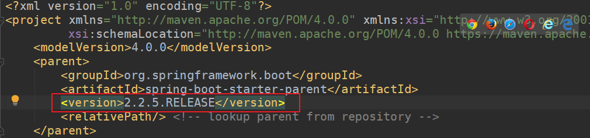
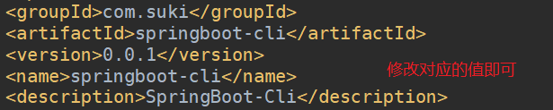
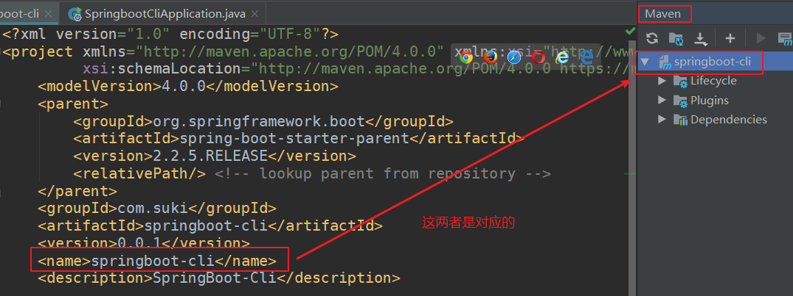
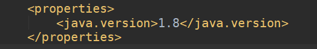
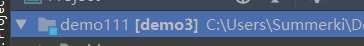
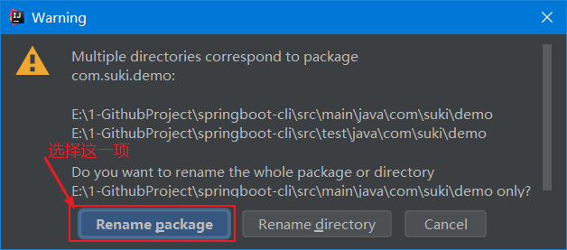
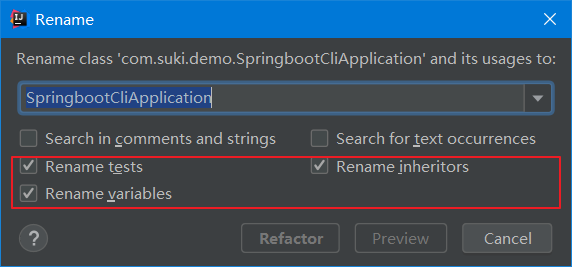

[TOC]

> 自用SpringBoot脚手架，很简单的一个脚手架，自己开发时可以省去很多麻烦
>
> 就叫SpringBoot-Cli吧
>
> 本Note存储有关搭建SpringBoot-Cli时的笔记

## 1、SpringBoot版本

该`SpringBoot-Cli`基于SpringBoot`2.2.5`版本

需要更改SpringBoot版本请修改`pom.xml`，如下：



## 2、初始化工作

确定完版本之后，接下来是修改项目名，包名等初始化工作

在`pom.xml`里面修改`<groupId>`、`<artifactId>`、`<version>`、`<name>`以及`<description>`方法如下：



注，其中的`<name>`标签对应maven插件的名字，如下：



---

最后确认一下java的版本，`SpringBoot-Cli`使用`java 1.8`版本



## 3、修改模块名、基础包名和启动类名



将`SpringBoot-Cli`用IDEA打开后，会看到如上图所示根文件夹；其中`demo3`为模块名，`demo111`是其在电脑上文件夹的名称

右键`Refactor->Rename`可以更改模块名

---

在`SpringBoot-Cli`根包右键`Refactor->Rename`可以更改包名，记得选择如下所示选项，这样才能成功更改包名，不然只会更改文件夹的名称



---

同理，修改启动类的名称也是`Refactor->Rename`，记得选择下面三项：



## 4、resources文件夹

> 为了实现线上部署和开发时都可以有效的调试界面，我给出以下两种文件放置方式可供选择；分别是不使用模板引擎和使用模板引擎的文件放置配置方式

### 4.1、不使用模板引擎

在`pom.xml`里面去除`thymeleaf`依赖，我们使用SpringMVC来完成跳转的功能

我们先给出配置文件该怎么写：

```properties
# 设置视图的前缀和后缀
# 注：prefix不要忘记最后的"/"符号，一定要写，不然会出错；就算这样"/test/"最后的"/"也不能漏掉
spring.mvc.view.prefix=/
spring.mvc.view.suffix=.html

# 设置context-path（随你更改）
server.servlet.context-path=/demo

# 设置静态资源文件目录
spring.resources.static-locations=classpath:/static

# 所有的静态资源的网址映射，包括HTML、JS、CSS等（因为没有使用模板引擎，所以HTML也被视为是一种静态资源）
spring.mvc.static-path-pattern=/**

# 以下是一些注意点：
# 如果我们直接访问静态资源（指JS、CSS等资源，不包括HTML），不管是 spring.mvc.view.prefix 还是 spring.mvc.view.suffix ,还是其他的 spring.mvc.view 开头的属性，怎么配置都是没影响的。
# 但是@RequestMapping返回的view， 却又是在静态目录进行查找的（非thymeleaf等视图模板的情况，thymeleaf等是在templates下查找的），而且 spring.mvc.view.prefix 及 spring.mvc.view.suffix 都是有效的。
# 这里应该要理清， 不然容易搞混。

# springboot在查找spring.mvc.view的时候，是去静态资源目录去查找的，也就是 spring.resources.static-locations 对应的目录。
# 在没有使用模板的情况下，@RequestMapping返回的view，也是在静态目录进行查找的
# 定义好上面配置后，springboot会从 [spring.resources.static-locations] + [spring.mvc.view.prefix] + [view name] + [spring.mvc.view.suffix] 返回视图
```

最后我们推荐在不使用模板引擎下的布局为：

```
- resources
	- static
		- js文件夹
			- xxx.js
		- css文件夹
			- xxx.css
		- xxx.html(注意，HTML文件只能放置在这一层，这样IDEA链接引用不会丢掉)
		- xxxx.html
```

这种方式html文件被视为是静态文件，可以通过浏览器直接访问到.html页面，当然通过controller也可以被访问到

这样你使用原生开发网页的套路完成布局后，按照上述规则直接全部放置在static文件夹下即可

### 4.2、使用模板引擎

添加`thymeleaf`依赖，此时html文件会被视为动态资源！

先给出配置该怎么写：

```properties
# 设置context-path(随你更改)
server.servlet.context-path=/demo

# 设置thymeleaf视图的前缀和后缀
spring.thymeleaf.prefix=classpath:/templates/
spring.thymeleaf.suffix=.html

# 设置静态资源的路径
spring.resources.static-locations=classpath:/static/
# 所有的静态资源的网址映射，包括JS、CSS等(不再包括HTML了)
# 意思就是 ip:port + [context-path] + /** 都会去[spring.resources.static-locations]下面找资源了
spring.mvc.static-path-pattern=/**
```

我们推荐使用模板引擎下的文件布局为：

```
- resources
	- static
		- js
			- xxx.js
		- css
			- xxx.css
		- lib(存放引用的库的位置)
		- images(存放图片)
	- templates
		- xxx.html
		- admin(管理员后台页面)
			- xxxx.html
		- error(error页面专门放在这里面)
			- 404.html
		- mobile(移动端页面)
			- xxxx.m.html
```

这种情况下可以在子文件夹下放置多个页面，controller返回时加上对应的文件夹名即可

其实这种方式我发现也有一点不好的，如果自定义的css标签里面有引用static目录下的资源，那么css必须分离出去成独立的一个文件再去引用，不然里面有些资源会出现404

总结下来使用模板引擎的前端开发流程：

1、设计好页面

2、将页面里的`<style>`标签的内容分离出去到`static/css`里面去，通过`<link>`引用；里面如果有引用要注意修改引用的路径！

3、将`<html lang="en">`改写为`<html lang="en" xmlns:th="http://www.thymeleaf.org">`

4、将页面里的`<link>、<script>、<a>`等标签添加`thymeleaf`独有标签实现引用，如：

`<link rel="stylesheet" href="../static/css/me.css" th:href="@{/css/me.css}">`

`<script src="../static/js/jquery-3.3.1.min.js" th:src="@{/js/jquery-3.3.1.min.js}"></script>`

`<a href="./2.html" th:href="@{/suki2}">点我</a>`

之所以保留原来的href、src元素是为了便于开发呀，这样你还是可以点击这些元素跳转到相应的静态资源里去

注意：如`th:href、th:src`自动就是以`spring.resources.static-locations`开头的，所以直接写里面的文件路径就好了！

5、通过这种方式我们不能直接访问到html文件，只能通过controller的方式访问到页面了；

---

目前我们采用`4.2`的方式放置页面吧

以后还是学习下前后端分离的模式吧，这样耦合在一起太难受了

## 5、日志处理

## 6、设计与规范


