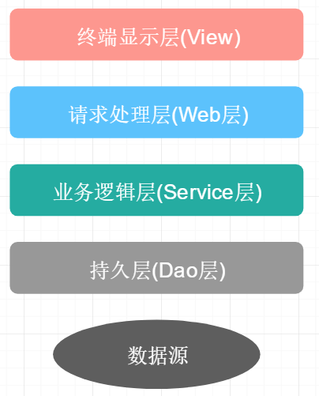
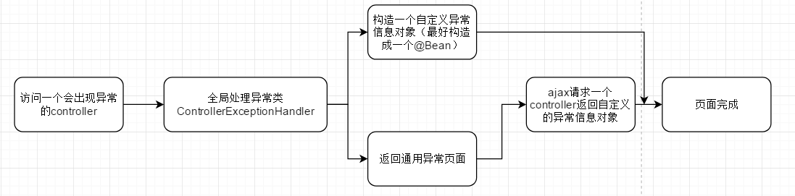

[TOC]

> 自用SpringBoot脚手架，很简单的一个脚手架，自己开发时可以省去很多麻烦
>
> 就叫SpringBoot-Cli吧
>
> 本Note存储有关搭建SpringBoot-Cli时的笔记

## 1、SpringBoot版本

该`SpringBoot-Cli`基于SpringBoot`2.2.5`版本

需要更改SpringBoot版本请修改`pom.xml`，如下：


## 2、初始化工作

确定完版本之后，接下来是修改项目名，包名等初始化工作

在`pom.xml`里面修改`<groupId>`、`<artifactId>`、`<version>`、`<name>`以及`<description>`方法如下：


注，其中的`<name>`标签对应maven插件的名字，如下：


---

最后确认一下java的版本，`SpringBoot-Cli`使用`java 1.8`版本


## 3、修改模块名、基础包名和启动类名


将`SpringBoot-Cli`用IDEA打开后，会看到如上图所示根文件夹；其中`demo3`为模块名，`demo111`是其在电脑上文件夹的名称

右键`Refactor->Rename`可以更改模块名

---

在`SpringBoot-Cli`根包右键`Refactor->Rename`可以更改包名，记得选择如下所示选项，这样才能成功更改包名，不然只会更改文件夹的名称


---

同理，修改启动类的名称也是`Refactor->Rename`，记得选择下面三项：


## 4、resources文件夹

> 为了实现线上部署和开发时都可以有效的调试界面，我给出以下两种文件放置方式可供选择；分别是不使用模板引擎和使用模板引擎的文件放置配置方式

### 4.1、不使用模板引擎

在`pom.xml`里面去除`thymeleaf`依赖，我们使用SpringMVC来完成跳转的功能

我们先给出配置文件该怎么写：

```properties
# 设置视图的前缀和后缀
# 注：prefix不要忘记最后的"/"符号，一定要写，不然会出错；就算这样"/test/"最后的"/"也不能漏掉
spring.mvc.view.prefix=/
spring.mvc.view.suffix=.html

# 设置context-path（随你更改）
server.servlet.context-path=/demo

# 设置静态资源文件目录
spring.resources.static-locations=classpath:/static

# 所有的静态资源的网址映射，包括HTML、JS、CSS等（因为没有使用模板引擎，所以HTML也被视为是一种静态资源）
spring.mvc.static-path-pattern=/**

# 以下是一些注意点：
# 如果我们直接访问静态资源（指JS、CSS等资源，不包括HTML），不管是 spring.mvc.view.prefix 还是 spring.mvc.view.suffix ,还是其他的 spring.mvc.view 开头的属性，怎么配置都是没影响的。
# 但是@RequestMapping返回的view， 却又是在静态目录进行查找的（非thymeleaf等视图模板的情况，thymeleaf等是在templates下查找的），而且 spring.mvc.view.prefix 及 spring.mvc.view.suffix 都是有效的。
# 这里应该要理清， 不然容易搞混。

# springboot在查找spring.mvc.view的时候，是去静态资源目录去查找的，也就是 spring.resources.static-locations 对应的目录。
# 在没有使用模板的情况下，@RequestMapping返回的view，也是在静态目录进行查找的
# 定义好上面配置后，springboot会从 [spring.resources.static-locations] + [spring.mvc.view.prefix] + [view name] + [spring.mvc.view.suffix] 返回视图
```

最后我们推荐在不使用模板引擎下的布局为：

```
- resources
	- static
		- js文件夹
			- xxx.js
		- css文件夹
			- xxx.css
		- xxx.html(注意，HTML文件只能放置在这一层，这样IDEA链接引用不会丢掉)
		- xxxx.html
```

这种方式html文件被视为是静态文件，可以通过浏览器直接访问到.html页面，当然通过controller也可以被访问到

这样你使用原生开发网页的套路完成布局后，按照上述规则直接全部放置在static文件夹下即可

### 4.2、使用模板引擎

添加`thymeleaf`依赖，此时html文件会被视为动态资源！

先给出配置该怎么写：

```properties
# 设置context-path(随你更改)
server.servlet.context-path=/demo

# 设置thymeleaf视图的前缀和后缀
spring.thymeleaf.prefix=classpath:/templates/
spring.thymeleaf.suffix=.html

# 设置静态资源的路径
spring.resources.static-locations=classpath:/static/
# 所有的静态资源的网址映射，包括JS、CSS等(不再包括HTML了)
# 意思就是 ip:port + [context-path] + /** 都会去[spring.resources.static-locations]下面找资源了
spring.mvc.static-path-pattern=/**

# thymeleaf是一个模板引擎，缓存的意思是加载一次模板之后便不会在加载了，对于生产环境应该加上缓存，但是在开发过程中如果打开缓存，不方便开发人员调试。
# 试想一下，改一行html，就需要重启服务器，肯定是不方便的。
# 总结一下：本地开发环境下，需要把缓存关闭，否则调试成本太大。其他环境下缓存都需要打开。
spring.thymeleaf.cache=false
```

我们推荐使用模板引擎下的文件布局为：

```
- resources
	- static
		- js
			- xxx.js
		- css
			- xxx.css
		- lib(存放引用的库的位置)
		- images(存放图片)
	- templates
		- xxx.html
		- admin(管理员后台页面)
			- xxxx.html
		- error(error页面专门放在这里面)
			- 404.html
		- mobile(移动端页面)
			- xxxx.m.html
```

这种情况下可以在子文件夹下放置多个页面，controller返回时加上对应的文件夹名即可

其实这种方式我发现也有一点不好的，如果自定义的css标签里面有引用static目录下的资源，那么css必须分离出去成独立的一个文件再去引用，不然里面有些资源会出现404

总结下来使用模板引擎的前端开发流程：

1、设计好页面

2、将页面里的`<style>`标签的内容分离出去到`static/css`里面去，通过`<link>`引用；里面如果有引用要注意修改引用的路径！

3、将`<html lang="en">`改写为`<html lang="en" xmlns:th="http://www.thymeleaf.org">`

4、将页面里的`<link>、<script>、<a>`等标签添加`thymeleaf`独有标签实现引用，如：

`<link rel="stylesheet" href="../static/css/me.css" th:href="@{/css/me.css}">`

`<script src="../static/js/jquery-3.3.1.min.js" th:src="@{/js/jquery-3.3.1.min.js}"></script>`

`<a href="./2.html" th:href="@{/suki2}">点我</a>`

之所以保留原来的href、src元素是为了便于开发呀，这样你还是可以点击这些元素跳转到相应的静态资源里去

注意：如`th:href、th:src`自动就是以`spring.resources.static-locations`开头的，所以直接写里面的文件路径就好了！

5、通过这种方式我们不能直接访问到html文件，只能通过controller的方式访问到页面了；

### 4.3、小结

目前我们采用`4.2`的方式放置页面吧

以后还是学习下前后端分离的模式吧，这样耦合在一起太难受了

## 5、日志处理

### 5.1、使用slf4j控制日志-继承logback设置

继承Spring boot logback设置（可以在appliaction.yml或者application.properties设置`logging.*`属性）

springboot自动为我们配置好了slf4j，我们直接就可以使用了

日志级别总共有TARCE < DEBUG < INFO < WARN < ERROR < FATAL ，且级别是逐渐提供，如果日志级别设置为INFO，则意味TRACE和DEBUG级别的日志都看不到

我们也可以配合Lombok的`@Slf4j`注解和IDEA的Lombok的插件来使用，这样我们就可以不用写`private final Logger logger = LoggerFactory.getLogger(this.getClass());`

示例：

```properties
# 这里是用的root级别，即项目的所有日志
logging.level.root=info
# 我们也可以使用package级别，即指定包下使用相应的日志级别[com.suki.demo4为包名]
logging.level.com.suki.demo4=trace
logging.level.com.suki=trace

# 指定记录log的文件名字
logging.file.name=testLog.log
# 指定记录log的文件夹，一般写为绝对路径，里面的日志文件springboot默认生成为spring.log
logging.file.path=E:/Log
# 注意上面这两者不会共存，至少我现在测试是这样的
# 注：logging.file.name和logging.file.path都存在的情况下，logging.file.name生效

#  在控制台输出的日志的格式
logging.pattern.console=%d{yyyy-MM-dd HH:mm:ss.SSS} [%thread] %-5level %logger{50} - %msg%n
# 指定文件中日志输出的格式
logging.pattern.file=%d{yyyy-MM-dd HH:mm:ss.SSS} === [%thread] === %-5level === %logger{50} ==== %msg%n
```

### 5.2、重写默认配置

我们重写一份xml文件配置覆盖springboot默认的配置，最后用`logging.config`指定其位置使用即可

参考：

https://qtdebug.com/html/spring-boot/%E6%97%A5%E5%BF%97%E9%85%8D%E7%BD%AE.html

https://www.jianshu.com/p/d2fdaba60327

https://www.cnblogs.com/harrychinese/p/springboot_logging.html

https://www.jianshu.com/p/6f093b0b0c8a

https://www.cnblogs.com/ningwuyu/p/12030391.html

https://www.cnblogs.com/sybblogs/p/10373908.html

### 5.3、巧技：使用linux命令记录日志

我们将springboot打成jar包准备在linux上运行时，请使用如下命令：

```
nohup java -jar xxx.jar [Arg...] & 
```

这样原本在控制台输出的文本会跑到jar包同级目录下的`nohup.out`里去，个人认为这也是一个非常好的记录方法

参考：https://www.cnblogs.com/sandea/p/10716399.html

## 6、设计与规范

我们约定包名如下规则：

```
- aspect // 切面
	- LogAspect.java
    - xxxAspect.java
- dao // data access object;用于封装对数据库的访问;持久层
	- Get/List/Count/Save/Remove/UpdateXXXDao.java
- handler // 可用于异常处理;handler我理解为处理者
	- ControllerExceptionHandler.java
- interceptor // 拦截器
	- xxxInterceptor.java
- po // persistant object持久对象；最形象的理解就是一个PO就是数据库中的一条记录
- service // 业务逻辑层
	- xxxService.java // 接口
	- xxxServiceImpl.java // 对应接口实现类
- util // 工具类
	- xxxUtils.java 
- vo // value object;用来装数据用的，而这个数据往往跟数据库没什么关系
- web // 请求处理层
	- xxxController.java
- config // 配置
	- WebConfig.java
	- xxxConfig.java
- exception // 自定义异常
	- xxxException.java
```

---

```java
// 我们在Service层应该这样写

// xxxService.java里面：
public interface xxxService() {
    // ...
}

// xxxServiceImpl.java里面
@Service // @Service注解标注在实现类上
public class xxxServiceImpl() {
 	// ...   
}

// 注入到其他类时：
@Autowired
private xxxService xxxService; // 我们这里声明的是接口，但实际上注入的是该接口的实现类
```


### 6.1、应用分层



### 6.2、Service/Dao层命名约定

+ 获取单个对象的方法用get做前缀。
+ 获取多个对象的方法用list做前缀。
+ 获取统计值的方法用count做前缀。
+ 插入的方法用save（推荐）或insert做前缀。
+ 删除的方法用remove（推荐）或delete做前缀。
+ 修改的方法用update做前缀。

## 7、异常页面处理

springboot自动配置好了异常页面，只要我们遵守下面的结构，出现相应的错误就会跳转到相应的自定义的页面去：

```
- resources
	- templates
		- error
			- 4xx.html // 用户那边的错误
			- 5xx.html // 服务器内部错误
```

### 7.1、自定义错误页面

参考：

https://www.jianshu.com/p/40096e2772f7（推荐）

https://blog.csdn.net/qq_35783095/article/details/86600558（推荐）

https://blog.csdn.net/chengyuqiang/article/details/88180538

https://blog.csdn.net/futao__/article/details/82826564

https://blog.csdn.net/qq_24598601/article/details/89243914

https://my.oschina.net/mengyuankan/blog/2222140

个人习惯的方式，不返回错误页面，而是返回错误的json数据，我拿到错误的json数据后再填入到网页中去，我现在想的流程如下：

1、访问一个controller，出现异常

2、跑到全局异常处理类（`@ControllerAdvice`）里面去，根据`@ExceptionHandler`找到对应的异常的处理类，里面干两件事情，一是组织好此次的异常json信息，二是返回通用异常页面

3、返回的通用异常页面上会有一个ajax请求来请求另一个controller返回刚才组织好的异常json信息来显示在页面上



注：刚才看到上面这个流程想到这里涉及到了`两次请求`，而且这里的自定义异常对象不好怎么处理给ajax请求，想到可以使用`redirect`重定向来解决这个问题，我们可以重定向到通用异常页面，而且在`RedirectAttributes`携带好要用的异常信息，这样就完美了！

`RedirectAttributes`的使用：https://www.cnblogs.com/g-smile/p/9121335.html

---

一般的样式代码：

```java
// 自定义异常：一般都是继承自RuntimeException
public class MyException extends RuntimeException {

    public NotFoundException() {
    }

    public NotFoundException(String message) {
        super(message);
    }

    public NotFoundException(String message, Throwable cause) {
        super(message, cause);
    }
}

// 全局异常处理：
@ControllerAdvice
public class ControllerExceptionHandler {

    private final Logger logger = LoggerFactory.getLogger(this.getClass());
	
    @ExceptionHandler(value = IllegalArgumentException.class) // 处理java内置的异常
    @ResponseBody
    // @ResponseStatus(HttpStatus.INTERNAL_SERVER_ERROR)
    private Result illegalArgumentExceptionHandler(HttpServletRequest request, Exception e) {
        System.out.println("IllegalArgumentException 异常: " + e.getClass().getName());
        return Result.error(ResultTypeEnum.PARAM_ERROR,"请求地址："+request.getRequestURI());
    }
    
    // 处理自定义的MyException异常
    @ExceptionHandler(value = MyException.class) // 你要处理什么类型的异常都在这里写就行了
    @ResponseBody
    // @ResponseStatus(HttpStatus.INTERNAL_SERVER_ERROR)
    private String myExceptionHandler(HttpServletRequest request,MyException e) {
        // 1. 将异常信息存入构造好的异常对象中
        // 2. 返回通用异常页面
    }
    
    // 默认异常捕获，上面异常没走的话走我
    @ExceptionHandler
    @ResponseBody
    // @ResponseStatus(HttpStatus.INTERNAL_SERVER_ERROR)
    private String myExceptionHandler(HttpServletRequest request,MyException e) {
        // 1. 将异常信息存入构造好的异常对象中
        // 2. 返回通用异常页面
    }
}

// 抛出异常的controller的写法：
@Controller
public class xxx {
    @RequestMapping("/throwMyException")
    public void throwMyException(){
        throw new MyException("我是主动抛出来的");
    }
}
```


## 8、配置切面

## 9、连接数据库配置

### 9.1、整合Druid

### 9.2、JdbcTemplate

注：

Controller返回值有四种：Map、String、Json、void

Map如果不加@ResponseBody注解，会和Model、ModelAndView一样属于request域的内容，可在thymeleaf里面引用；如果加了@ResponseBody注解相当于直接返回json数据


