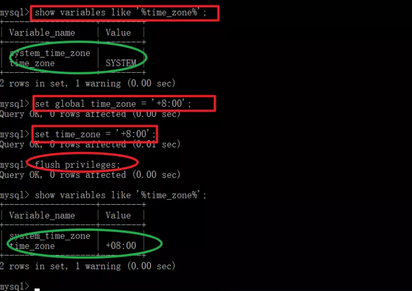

[TOC]

> 自用SpringBoot脚手架，很简单的一个脚手架，自己开发时可以省去很多麻烦
>
> 就叫SpringBoot-Cli吧
>
> 本Note存储有关搭建SpringBoot-Cli时的笔记

## 1、SpringBoot版本

该`SpringBoot-Cli`基于SpringBoot`2.2.5`版本

需要更改SpringBoot版本请修改`pom.xml`，如下：


## 2、初始化工作

确定完版本之后，接下来是修改项目名，包名等初始化工作

在`pom.xml`里面修改`<groupId>`、`<artifactId>`、`<version>`、`<name>`以及`<description>`方法如下：


注，其中的`<name>`标签对应maven插件的名字，如下：


---

最后确认一下java的版本，`SpringBoot-Cli`使用`java 1.8`版本


## 3、修改模块名、基础包名和启动类名


将`SpringBoot-Cli`用IDEA打开后，会看到如上图所示根文件夹；其中`demo3`为模块名，`demo111`是其在电脑上文件夹的名称

右键`Refactor->Rename`可以更改模块名

---

在`SpringBoot-Cli`根包右键`Refactor->Rename`可以更改包名，记得选择如下所示选项，这样才能成功更改包名，不然只会更改文件夹的名称


---

同理，修改启动类的名称也是`Refactor->Rename`，记得选择下面三项：


## 4、resources文件夹

> 为了实现线上部署和开发时都可以有效的调试界面，我给出以下两种文件放置方式可供选择；分别是不使用模板引擎和使用模板引擎的文件放置配置方式

### 4.1、不使用模板引擎

在`pom.xml`里面去除`thymeleaf`依赖，我们使用SpringMVC来完成跳转的功能

我们先给出配置文件该怎么写：

```properties
# 设置视图的前缀和后缀
# 注：prefix不要忘记最后的"/"符号，一定要写，不然会出错；就算这样"/test/"最后的"/"也不能漏掉
spring.mvc.view.prefix=/
spring.mvc.view.suffix=.html

# 设置context-path（随你更改）
server.servlet.context-path=/demo

# 设置静态资源文件目录
spring.resources.static-locations=classpath:/static

# 所有的静态资源的网址映射，包括HTML、JS、CSS等（因为没有使用模板引擎，所以HTML也被视为是一种静态资源）
spring.mvc.static-path-pattern=/**

# 以下是一些注意点：
# 如果我们直接访问静态资源（指JS、CSS等资源，不包括HTML），不管是 spring.mvc.view.prefix 还是 spring.mvc.view.suffix ,还是其他的 spring.mvc.view 开头的属性，怎么配置都是没影响的。
# 但是@RequestMapping返回的view， 却又是在静态目录进行查找的（非thymeleaf等视图模板的情况，thymeleaf等是在templates下查找的），而且 spring.mvc.view.prefix 及 spring.mvc.view.suffix 都是有效的。
# 这里应该要理清， 不然容易搞混。

# springboot在查找spring.mvc.view的时候，是去静态资源目录去查找的，也就是 spring.resources.static-locations 对应的目录。
# 在没有使用模板的情况下，@RequestMapping返回的view，也是在静态目录进行查找的
# 定义好上面配置后，springboot会从 [spring.resources.static-locations] + [spring.mvc.view.prefix] + [view name] + [spring.mvc.view.suffix] 返回视图
```

最后我们推荐在不使用模板引擎下的布局为：

```
- resources
	- static
		- js文件夹
			- xxx.js
		- css文件夹
			- xxx.css
		- xxx.html(注意，HTML文件只能放置在这一层，这样IDEA链接引用不会丢掉)
		- xxxx.html
```

这种方式html文件被视为是静态文件，可以通过浏览器直接访问到.html页面，当然通过controller也可以被访问到

这样你使用原生开发网页的套路完成布局后，按照上述规则直接全部放置在static文件夹下即可

### 4.2、使用模板引擎

添加`thymeleaf`依赖，此时html文件会被视为动态资源！

先给出配置该怎么写：

```properties
# 设置context-path(随你更改)
server.servlet.context-path=/demo

# 设置thymeleaf视图的前缀和后缀
spring.thymeleaf.prefix=classpath:/templates/
spring.thymeleaf.suffix=.html

# 设置静态资源的路径
spring.resources.static-locations=classpath:/static/
# 所有的静态资源的网址映射，包括JS、CSS等(不再包括HTML了)
# 意思就是 ip:port + [context-path] + /** 都会去[spring.resources.static-locations]下面找资源了
spring.mvc.static-path-pattern=/**

# thymeleaf是一个模板引擎，缓存的意思是加载一次模板之后便不会在加载了，对于生产环境应该加上缓存，但是在开发过程中如果打开缓存，不方便开发人员调试。
# 试想一下，改一行html，就需要重启服务器，肯定是不方便的。
# 总结一下：本地开发环境下，需要把缓存关闭，否则调试成本太大。其他环境下缓存都需要打开。
spring.thymeleaf.cache=false
```

我们推荐使用模板引擎下的文件布局为：

```
- resources
	- static
		- js
			- xxx.js
		- css
			- xxx.css
		- lib(存放引用的库的位置)
		- images(存放图片)
	- templates
		- xxx.html
		- admin(管理员后台页面)
			- xxxx.html
		- error(error页面专门放在这里面)
			- 404.html
		- mobile(移动端页面)
			- xxxx.m.html
```

这种情况下可以在子文件夹下放置多个页面，controller返回时加上对应的文件夹名即可

其实这种方式我发现也有一点不好的，如果自定义的css标签里面有引用static目录下的资源，那么css必须分离出去成独立的一个文件再去引用，不然里面有些资源会出现404

总结下来使用模板引擎的前端开发流程：

1、设计好页面

2、将页面里的`<style>`标签的内容分离出去到`static/css`里面去，通过`<link>`引用；里面如果有引用要注意修改引用的路径！

3、将`<html lang="en">`改写为`<html lang="en" xmlns:th="http://www.thymeleaf.org">`

4、将页面里的`<link>、<script>、<a>`等标签添加`thymeleaf`独有标签实现引用，如：

`<link rel="stylesheet" href="../static/css/me.css" th:href="@{/css/me.css}">`

`<script src="../static/js/jquery-3.3.1.min.js" th:src="@{/js/jquery-3.3.1.min.js}"></script>`

`<a href="./2.html" th:href="@{/suki2}">点我</a>`

之所以保留原来的href、src元素是为了便于开发呀，这样你还是可以点击这些元素跳转到相应的静态资源里去

注意：如`th:href、th:src`自动就是以`spring.resources.static-locations`开头的，所以直接写里面的文件路径就好了！

5、通过这种方式我们不能直接访问到html文件，只能通过controller的方式访问到页面了；

### 4.3、小结

目前我们采用`4.2`的方式放置页面吧

以后还是学习下前后端分离的模式吧，这样耦合在一起太难受了

## 5、日志处理

### 5.1、使用slf4j控制日志-继承logback设置

继承Spring boot logback设置（可以在appliaction.yml或者application.properties设置`logging.*`属性）

springboot自动为我们配置好了slf4j，我们直接就可以使用了

日志级别总共有TARCE < DEBUG < INFO < WARN < ERROR < FATAL ，且级别是逐渐提供，如果日志级别设置为INFO，则意味TRACE和DEBUG级别的日志都看不到

我们也可以配合Lombok的`@Slf4j`注解和IDEA的Lombok的插件来使用，这样我们就可以不用写`private final Logger logger = LoggerFactory.getLogger(this.getClass());`

示例：

```properties
# 这里是用的root级别，即项目的所有日志
logging.level.root=info
# 我们也可以使用package级别，即指定包下使用相应的日志级别[com.suki.demo4为包名]
logging.level.com.suki.demo4=trace
logging.level.com.suki=trace

# 指定记录log的文件名字
logging.file.name=testLog.log
# 指定记录log的文件夹，一般写为绝对路径，里面的日志文件springboot默认生成为spring.log
logging.file.path=E:/Log
# 注意上面这两者不会共存，至少我现在测试是这样的
# 注：logging.file.name和logging.file.path都存在的情况下，logging.file.name生效

#  在控制台输出的日志的格式
logging.pattern.console=%d{yyyy-MM-dd HH:mm:ss.SSS} [%thread] %-5level %logger{50} - %msg%n
# 指定文件中日志输出的格式
logging.pattern.file=%d{yyyy-MM-dd HH:mm:ss.SSS} === [%thread] === %-5level === %logger{50} ==== %msg%n
```

### 5.2、重写默认配置

我们重写一份xml文件配置覆盖springboot默认的配置，最后用`logging.config`指定其位置使用即可

参考：

https://qtdebug.com/html/spring-boot/%E6%97%A5%E5%BF%97%E9%85%8D%E7%BD%AE.html

https://www.jianshu.com/p/d2fdaba60327

https://www.cnblogs.com/harrychinese/p/springboot_logging.html

https://www.jianshu.com/p/6f093b0b0c8a

https://www.cnblogs.com/ningwuyu/p/12030391.html

https://www.cnblogs.com/sybblogs/p/10373908.html

### 5.3、巧技：使用linux命令记录日志

我们将springboot打成jar包准备在linux上运行时，请使用如下命令：

```
nohup java -jar xxx.jar [Arg...] & 
```

这样原本在控制台输出的文本会跑到jar包同级目录下的`nohup.out`里去，个人认为这也是一个非常好的记录方法

参考：https://www.cnblogs.com/sandea/p/10716399.html

## 6、设计与规范

我们约定包名如下规则：

```
- aspect // 切面
	- LogAspect.java
    - xxxAspect.java
- dao // data access object;用于封装对数据库的访问;持久层
	- Get/List/Count/Save/Remove/UpdateXXXDao.java
- handler // 可用于异常处理;handler我理解为处理者
	- ControllerExceptionHandler.java
- interceptor // 拦截器
	- xxxInterceptor.java
- po // persistant object持久对象；最形象的理解就是一个PO就是数据库中的一条记录
- service // 业务逻辑层
	- xxxService.java // 接口
	- xxxServiceImpl.java // 对应接口实现类
- util // 工具类
	- xxxUtils.java 
- vo // value object;用来装数据用的，而这个数据往往跟数据库没什么关系
- web // 请求处理层
	- xxxController.java
- config // 配置
	- WebConfig.java
	- xxxConfig.java
- exception // 自定义异常
	- xxxException.java
```

---

```java
// 我们在Service层应该这样写

// xxxService.java里面：
public interface xxxService() {
    // ...
}

// xxxServiceImpl.java里面
@Service // @Service注解标注在实现类上
public class xxxServiceImpl() {
 	// ...   
}

// 注入到其他类时：
@Autowired
private xxxService xxxService; // 我们这里声明的是接口，但实际上注入的是该接口的实现类
```


### 6.1、应用分层


### 6.2、Service/Dao层命名约定

+ 获取单个对象的方法用get做前缀。
+ 获取多个对象的方法用list做前缀。
+ 获取统计值的方法用count做前缀。
+ 插入的方法用save（推荐）或insert做前缀。
+ 删除的方法用remove（推荐）或delete做前缀。
+ 修改的方法用update做前缀。

---

+ Controller加`@Controller`注解
+ ServiceImpl加`@Service`注解
+ Dao加`@Repository`注解

## 7、异常页面处理

springboot自动配置好了异常页面，只要我们遵守下面的结构，出现相应的错误就会跳转到相应的自定义的页面去：

```
- resources
	- templates
		- error
			- 4xx.html // 用户那边的错误
			- 5xx.html // 服务器内部错误
```

### 7.1、自定义错误页面

参考：

https://www.jianshu.com/p/40096e2772f7（推荐）

https://blog.csdn.net/qq_35783095/article/details/86600558（推荐）

https://blog.csdn.net/chengyuqiang/article/details/88180538

https://blog.csdn.net/futao__/article/details/82826564

https://blog.csdn.net/qq_24598601/article/details/89243914

https://my.oschina.net/mengyuankan/blog/2222140

个人习惯的方式，不返回错误页面，而是返回错误的json数据，我拿到错误的json数据后再填入到网页中去，我现在想的流程如下：

1、访问一个controller，出现异常

2、跑到全局异常处理类（`@ControllerAdvice`）里面去，根据`@ExceptionHandler`找到对应的异常的处理类，里面干两件事情，一是组织好此次的异常json信息，二是返回通用异常页面

3、返回的通用异常页面上会有一个ajax请求来请求另一个controller返回刚才组织好的异常json信息来显示在页面上


注：刚才看到上面这个流程想到这里涉及到了`两次请求`，而且这里的自定义异常对象不好怎么处理给ajax请求，想到可以使用`redirect`重定向来解决这个问题，我们可以重定向到通用异常页面，而且在`RedirectAttributes`携带好要用的异常信息，这样就完美了！

`RedirectAttributes`的使用：https://www.cnblogs.com/g-smile/p/9121335.html；有`addAttributie`和`addFlashAttributie`，推荐使用`addFlashAttributie`方法添加参数。

---

一般的样式代码：

```java
// 自定义异常：一般都是继承自RuntimeException
public class MyException extends RuntimeException {

    public NotFoundException() {
    }

    public NotFoundException(String message) {
        super(message);
    }

    public NotFoundException(String message, Throwable cause) {
        super(message, cause);
    }
}

// 全局异常处理：
@ControllerAdvice
public class ControllerExceptionHandler {

    private final Logger logger = LoggerFactory.getLogger(this.getClass());
	
    @ExceptionHandler(value = IllegalArgumentException.class) // 处理java内置的异常
    @ResponseBody
    // @ResponseStatus(HttpStatus.INTERNAL_SERVER_ERROR)
    private Result illegalArgumentExceptionHandler(HttpServletRequest request, Exception e) {
        System.out.println("IllegalArgumentException 异常: " + e.getClass().getName());
        return Result.error(ResultTypeEnum.PARAM_ERROR,"请求地址："+request.getRequestURI());
    }
    
    // 处理自定义的MyException异常
    @ExceptionHandler(value = MyException.class) // 你要处理什么类型的异常都在这里写就行了
    @ResponseBody
    // @ResponseStatus(HttpStatus.INTERNAL_SERVER_ERROR)
    private String myExceptionHandler(HttpServletRequest request,MyException e) {
        // 1. 将异常信息存入构造好的异常对象中
        // 2. 返回通用异常页面
    }
    
    // 默认异常捕获，上面异常没走的话走我
    @ExceptionHandler
    @ResponseBody
    // @ResponseStatus(HttpStatus.INTERNAL_SERVER_ERROR)
    private String myExceptionHandler(HttpServletRequest request,MyException e) {
        // 1. 将异常信息存入构造好的异常对象中
        // 2. 返回通用异常页面
    }
}

// 抛出异常的controller的写法：
@Controller
public class xxx {
    @RequestMapping("/throwMyException")
    public void throwMyException(){
        throw new MyException("我是主动抛出来的");
    }
}
```

## 8、配置切面

切面也是个好东西，注解了切面的类/方法可以设置其执行前后都有什么动作

我们知道切面表达式该怎么写即可：

```
execution(public  * com.sz.*.*())
访问修饰符 + 返回值类型 + 包 + 类 + 方法 + 参数列表 + 异常声明描述
*是所有的意思
..多层的意义，意思就是包含子包

举例：
1、
execution(public  * com.sz.*.login())
public 的 任意返回值类型的必须在com.sz包下面的任意的方法的必须方法名为login的且参数是无参才可以
2、
execution(public  * com.sz.*.login(String))
public 的 任意返回值类型的必须在com.sz包下面的任意的方法的必须方法名为login的且参数是一个参数的，类型为String的才可以
3、
execution(public  * com.sz.*.log*())
public 的 任意返回值类型的必须在com.sz包下面的任意的方法的必须方法名为log开头的，且参数是无参的
4、
execution(public  * com.sz.*.*(double,double))
对于参数要求是两个，并且都是double，参数之间使用逗号分隔即可
5、
execution(public  * com.sz.*.*(..))
任意参数，无参，有参，以及对参数的数据类型都没有要求
6、
execution(public  * com.sz..*.*(..))
com.sz包下的任意包（包含子包）的任意类的任意方法的任意参数
7、
execution(public  com.sz.Girl com.sz..*.*(..))
是对返回值类型要求必须是 com.sz.Girl
```

下面是一个利用切面的例子：

```java
Aspect
@Component
public class LogAspect { // 记录每次访问每个controller的url/ip/method/args

    private final Logger logger = LoggerFactory.getLogger(this.getClass());
	
	// 切点，log()随便取什么名字都行，重要的是它的Pointcut切面注解
    @Pointcut("execution(* com.lrm.web.*.*(..))")
    public void log() {}

	
    @Before("log()")
    public void doBefore(JoinPoint joinPoint) { // JoinPoint参数！！！
    	// 注意，这里是一种不在controller里面获取request的方法！！！很有用
        ServletRequestAttributes attributes = (ServletRequestAttributes) RequestContextHolder.getRequestAttributes();
        HttpServletRequest request = attributes.getRequest();
        // 通过request获取url和ip
        String url = request.getRequestURL().toString();
        String ip = request.getRemoteAddr();
        // 通过JoinPoint获取调用的方法名和参数
        String classMethod = joinPoint.getSignature().getDeclaringTypeName() + "." + joinPoint.getSignature().getName();
        Object[] args = joinPoint.getArgs();
        
        RequestLog requestLog = new RequestLog(url, ip, classMethod, args);
        logger.info("Request : {}", requestLog);
    }

    @After("log()")
    public void doAfter() {
//        logger.info("--------doAfter--------");
    }
	
	// 带有返回值的After
    @AfterReturning(returning = "result",pointcut = "log()") // returning对应下面函数的同名参数
    public void doAfterRuturn(Object result) {
        logger.info("Result : {}", result);
    }

    private class RequestLog {
        private String url;
        private String ip;
        private String classMethod;
        private Object[] args;

        public RequestLog(String url, String ip, String classMethod, Object[] args) {
            this.url = url;
            this.ip = ip;
            this.classMethod = classMethod;
            this.args = args;
        }

        @Override
        public String toString() {
            return "{" +
                    "url='" + url + '\'' +
                    ", ip='" + ip + '\'' +
                    ", classMethod='" + classMethod + '\'' +
                    ", args=" + Arrays.toString(args) +
                    '}';
        }
    }

}
```

## 9、@RequestParam/@PathVariable/@RequestBody/@ResponseBody

```
@RequestParam和@PathVariable的使用：
例如请求网址：http://localhost:8080/springmvc/hello/101?param1=10&param2=20
则对应的controller为：
@RequestMapping("/hello/{id}")
public String getDetails(@PathVariable(value="id") String id,
					     @RequestParam(value="param1", required=true) String param1,
                         @RequestParam(value="param2", required=false) String param2){
	// .......
}
```

@RequestBody其实很少用吧，参考：https://blog.csdn.net/justry_deng/article/details/80972817

@ResponseBody用于返回json数据

## 10、profile

如果按照之前的properties配置文件书写，那么我们有些地方（比如数据库连接）在测试和实际发布时都会要做很大修改，这样过于麻烦，profile机制给我们很大便捷

springboot约定不同环境下的配置文件名称规则为`application-{profile}.properties`，主配置文件为`application.properties`

所以，配置文件位置规则如下：

```
- resources
	- application-dev.properties // 开发配置
	- application-prod.properties // 生产配置
	- application.properties // 主配置；并决定采用哪个配置
```

我们在`application.properties`使用`spring.profiles.active=dev/prod`来指定加载哪个配置文件

## 11、数据库相关配置

### 11.1、基础设置

最基础的jdbc配置如下：

参考：https://www.jianshu.com/p/e4ffdb5d81da

```properties
spring.datasource.username=root
spring.datasource.password=123456
spring.datasource.url=jdbc:mysql://127.0.0.1:3306/[数据库名称]?useUnicode=true&characterEncoding=UTF8&serverTimezone=GMT
# 如果mysql.cj.jdbc是红色的话，把pom文件mysql那里的<scope>runtime</scope>去掉即可
spring.datasource.driver-class-name=com.mysql.cj.jdbc.Driver
```

#### 注：mysql更改时区方法

在运行springboot程序时若出现了：`The server time zone value 'Öйú±ê׼ʱ¼ä' is unrecognized or represents more than one time zone`的错误


这是由于时区问题导致的, 只需要更改MySQL的时区，注意在英文状态下输入：

```
show variables like '%time_zone%'; 
set global time_zone = '+8:00';   //修改mysql全局时区为东8区，即北京时间
set time_zone = '+8:00'; //修改当前会话时区
flush privileges; //立即生效
```

效果：



这样就不会报错，springboot那边也可以输出数据源和连接了：


### 11.2、整合Druid

参考：

https://mp.weixin.qq.com/s?__biz=MzI4Njg5MDA5NA==&mid=2247484075&idx=1&sn=ca6f0f19c32eb3276a8b562888e49120&chksm=ebd743aadca0cabc934b891fdc4e116d573042f72ae87893df5c2883e46b96affac7c1923cab&scene=21###wechat_redirect

https://www.jianshu.com/p/e4ffdb5d81da

还参考了自己的springboot笔记：https://github.com/Summerki/SpringBoot_Note/blob/master/%E6%A0%B8%E5%BF%83%E6%8A%80%E6%9C%AF%E7%AF%87Note/SpringBoot.md

https://blog.csdn.net/wantnrun/article/details/94125917（这个讲的很详细）

https://www.jianshu.com/p/0027c3d6e0df（这个也不错，讲的很详细了）

1、首先引入druid依赖

```xml
<!-- https://mvnrepository.com/artifact/com.alibaba/druid -->
<dependency>
    <groupId>com.alibaba</groupId>
    <artifactId>druid</artifactId>
    <version>1.1.19</version>
</dependency>
```

2、相关配置文件如下：

```properties
# 这里上面都是一样的
spring.datasource.username=root
spring.datasource.password=
spring.datasource.url=jdbc:mysql://127.0.0.1:3306/springboot_test?useUnicode=true&characterEncoding=UTF8&serverTimezone=GMT
spring.datasource.driver-class-name=com.mysql.cj.jdbc.Driver

# 用来自定义数据源
spring.datasource.type=com.alibaba.druid.pool.DruidDataSource

# 其他额外配置：设置完后可以看到下面的配置背景填充，这因为下边这些配置无法绑定到DataSourceProperties上，即是这些配置没有生效
# 下面为连接池的补充设置，应用到上面所有数据源中
# 初始化大小，最小，最大
spring.datasource.initialSize=5
spring.datasource.minIdle=5
spring.datasource.maxActive=20
# 配置获取连接等待超时的时间
spring.datasource.maxWait=60000
# 配置间隔多久才进行一次检测，检测需要关闭的空闲连接，单位是毫秒
spring.datasource.timeBetweenEvictionRunsMillis=60000
# 配置一个连接在池中最小生存的时间，单位是毫秒
spring.datasource.minEvictableIdleTimeMillis=300000
spring.datasource.validationQuery=SELECT 1 FROM DUAL
spring.datasource.testWhileIdle=true
spring.datasource.testOnBorrow=false
spring.datasource.testOnReturn=false
# 打开PSCache，并且指定每个连接上PSCache的大小
spring.datasource.poolPreparedStatements=true
spring.datasource.maxPoolPreparedStatementPerConnectionSize=20
# 配置监控统计拦截的filters，去掉后监控界面sql无法统计，'wall'用于防火墙
# 原来的教程是stat,wall,log4j;这会导致我们需要加上log4j的依赖，但是我们用的是slf4j，所以改成下面这个形式
spring.datasource.filters=stat,wall,slf4j,default
# 通过connectProperties属性来打开mergeSql功能；慢SQL记录
spring.datasource.connectionProperties=druid.stat.mergeSql=true;druid.stat.slowSqlMillis=5000
# 合并多个DruidDataSource的监控数据
#spring.datasource.useGlobalDataSourceStat=true
```

3、配置druid数据源状态监控，配置一个拦截器和一个Servlet即可

```java
@Configuration
public class DruidConfig {

    @ConfigurationProperties(prefix = "spring.datasource")
    @Bean
    public DruidDataSource druidDataSource(){
        return new DruidDataSource();
    }

    //配置Druid的监控
    //1、配置一个管理后台的Servlet
    @Bean
    public ServletRegistrationBean statViewServlet(){
        ServletRegistrationBean bean = new ServletRegistrationBean(new StatViewServlet(), "/druid/*");
        Map<String,String> initParams = new HashMap<>();

        initParams.put("loginUsername","admin");
        initParams.put("loginPassword","123456");
        initParams.put("allow","");//默认就是允许所有访问
        // IP黑名单 (存在共同时，deny优先于allow) : 如果满足deny的话提示:Sorry, you are not permitted to view this page.
        initParams.put("deny","192.168.15.21");

        bean.setInitParameters(initParams);
        return bean;
    }


    //2、配置一个web监控的filter
    @Bean
    public FilterRegistrationBean webStatFilter(){
        FilterRegistrationBean bean = new FilterRegistrationBean();
        bean.setFilter(new WebStatFilter());

        Map<String,String> initParams = new HashMap<>();
        //添加不需要忽略的格式信息
        initParams.put("exclusions","*.js,*.css,/druid/*");
        bean.setInitParameters(initParams);
		
        // 添加过滤信息
        bean.setUrlPatterns(Arrays.asList("/*"));

        return  bean;
    }

}
```

### 11.3、JdbcTemplate

我觉得JdbcTemplate还挺好用的~所以在脚手架里面我决定使用jdbctemplate而先不使用其他框架

参考：

https://my.oschina.net/u/3480797/blog/3020706（重要！！！教你RowMapper接口的使用）

https://www.jianshu.com/p/be60a81e2fe7（重要）

https://www.jianshu.com/p/f0cbed671897

---

#### 常见的Java实体类和MySQL里面的类型的对应关系

关于讲述jdbctemplate这一节，我打算用下面这个例子（`Student类`）来讲解；也为以后做项目提供一个参考：

| 字段名称              | MySQL类型    | JavaBean类型   |
| --------------------- | :----------- | :------------- |
| id（主键，自增）      | int(255)     | long           |
| name                  | varchar(255) | string         |
| math_score            | varchar(255) | string         |
| english_score         | varchar(255) | string         |
| register_time         | timestamp    | java.util.date |
| is_registered(bool值) | tinyint(1)   | int            |

---

#### 存储到MySQL后发现时间相差8个小时的解决方法

参考：https://www.cnblogs.com/zwk2018/p/9639731.html

配置`spring.datasource.url`中更改为`serverTimezone=Asia/Shanghai `

也有可能有其他的解决方法~目前这个对我来说有效

---

#### @DateTimeFormat(pattern = "yyyy:MM:dd hh:mm:ss")

参考：https://www.cnblogs.com/doit8791/p/10493722.html

这是spring中的注解，可以对`java.util.Date、java.util.Calendar、java.long.Long`等进行格式化输出

在做项目时遇到JavaBean中有关于时间的属性，就将其设置为`java.util.Date`类型并且用`@DateTimeFormat`对其进行格式化

---

#### Time、Timestamp、Date之间的转换

参考：https://www.cnblogs.com/ljllove/p/9377075.html

因为我们设计时关于时间的变量，MySQL中是采用`timestamp`，JavaBean中采用`java.util.Date`，所以这里说明下这些表示时间的类的之间的转换关系

```
1、Java中的时间类型
原理：
java.sql.Date：表示日期，年月日，没有时分秒
java.sql.Time：表示时间，年月日时分秒
java.sql.Timestamp：表示时间戳，年月日时分秒毫秒

java.util.Date：年月日时分秒，上面三个都是其子类
java.util.Calendar：目前还没用到这个

2、时间类型之间的转换
把数据库的三种时间类型赋给java.util.Date，基本不用转换，因为这是把子类对象给父类的引用，不需要转换；如：
java.sql.Date sqlDate = new java.sql.Date();
java.util.Date utilDate = sqlDate;

当需要把java.util.Date转换成数据库的三种时间类型时，这就不能直接赋值了，这需要使用数据库三种时间类型的构造器。java.sql包下的Date、Time、TimeStamp三个类的构造器都需要一个long类型的参数，表示毫秒值。创建这三个类型的对象，只需要有毫秒值即可。我们知道java.util.Date有getTime()方法可以获取毫秒值，那么这个转换也就不是什么问题了；如：
java.util.Date utilDate = new java.util.Date();
java.sql.Date sqlDate = new java.sql.Date(utilDate.getTime());
```

---

#### JdbcTemplate五大API

参考：https://blog.csdn.net/qmdweb/article/details/81224330

+ `execute`方法：可以用于执行任何SQL语句，一般用于执行DDL语句
+ `update`方法及`batchUpdate`方法：update方法用于执行新增、修改、删除等语句；batchUpdate方法用于执行批处理相关语句
+ `query`方法及`queryForXXX`方法：用于执行查询相关语句
+ `call`方法：用于执行存储过程、函数相关语句

---

#### 增加单条数据

首先我们要明确的一点是，向数据库增加数据的语句中不应该有主键，因为如果执行了两次该增加操作就会出现`主键冲突`的情况

我们使用`jdbcTemplate.update()`

```java
// 增加单条数据方法1
public void addSingle_1() {
    // 因为主键为id，所以我们不应该在插入时插入id值，因为id主键会自增
    // String sql = "insert into spring_stu (id,name,math_score,english_score,register_time,is_registered) values (?,?,?,?,?,?)";
    // 应该使用下面这个sql表达式
    String sql = "insert into spring_stu (name,math_score,english_score,register_time,is_registered) values (?,?,?,?,?)";

    int res = jdbcTemplate.update(sql, "stu1", "90", "95", new Timestamp(new Date().getTime()), 1); // sql后面的参数为sql语句里面每个`?`要填入的东西
    log.info("影响行数: {}", res);
}

// 增加单条数据方法2
public void addSingle_2() {
    String sql = "insert into spring_stu (name,math_score,english_score,register_time,is_registered) values (?,?,?,?,?)";

    Student student = new Student(1, "stu1", "90", "95", new Date(), 1); // 构造了一个Student
    // 下面这种方法可以指定每个位置插入什么元素
    int res = jdbcTemplate.update(sql, new PreparedStatementSetter() {
        @Override
        public void setValues(PreparedStatement preparedStatement) throws SQLException {
            preparedStatement.setString(1, student.getName());
            preparedStatement.setString(2, student.getMathScore());
            preparedStatement.setString(3, student.getEnglishScore());
            preparedStatement.setTimestamp(4, new Timestamp(student.getRegisterTime().getTime()));
            preparedStatement.setInt(5, student.getIsRegistered());
        }
    });

    log.info("影响行数 {}", res);
}
```

---

#### 批量增加多条数据

我们使用`jdbcTemplate.batchUpdate()`

```java
// 批量增加多条数据方法1
public void addMultiple_1() {
    String sql = "insert into spring_stu (name,math_score,english_score,register_time,is_registered) values (?,?,?,?,?)";

    List<Object[]> paramList = new ArrayList<>(); // 必须是List<Object[]>!!!
    Object[] param;
    for (int i = 0; i < 10; i++) {
        param = new Object[]{"name"+i, i, i, new Date(), 0}; // 每个Object[]里面存放对应sql的`?`的值
        paramList.add(param);
    }

    int[] res = jdbcTemplate.batchUpdate(sql, paramList);

    log.info("批量增加 方法1 {}", res); // 返回值类似于[1,1,1,..]，代表每条插入记录是否成功；1成功0失败
}

// 批量增加多条数据方法2
public void addMultiple_2() {
    String sql = "insert into spring_stu (name,math_score,english_score,register_time,is_registered) values (?,?,?,?,?)";

    // 构造一组List<Student>
    List<Student> stuList = new ArrayList<>();
    Student stu;
    for (int i = 0; i < 10; i++) {
        stu = new Student(i, "name" + i, Integer.toString(i), Integer.toString(i), new Date(), 0);
        stuList.add(stu);
    }

	// 指定sql中每个`?`对应什么含义
    int[] res = jdbcTemplate.batchUpdate(sql, new BatchPreparedStatementSetter() {
        @Override
        public void setValues(PreparedStatement preparedStatement, int i) throws SQLException {
            preparedStatement.setLong(1, stuList.get(i).getId());
            preparedStatement.setString(2, stuList.get(i).getMathScore());
            preparedStatement.setString(3, stuList.get(i).getEnglishScore());
            preparedStatement.setTimestamp(4, new Timestamp(stuList.get(i).getRegisterTime().getTime()));
            preparedStatement.setInt(5, stuList.get(i).getIsRegistered());
        }

        @Override
        public int getBatchSize() {
            return stuList.size();
        }
    });

    log.info("批量更新 方法2 {}", res);
}
```

---

#### 极大加快`批量增加多条数据`的速度

参考：https://blog.csdn.net/shushugood/article/details/81005718

其实就是在`spring.datasource.url`上面加上`rewriteBatchedStatements=true`；亲测，速度真的加快非常多！！！

值得注意的是，用了这个后批量更新返回的数组里不再是1了，而是`-2`代表成功

---

#### 删除单条数据

也是使用`jdbcTemplate.update()`；其实和`增加单条数据`的做法一样，sql换了一下而已

```java
// 删除单条数据方法1
public void deleteSingle_1() {
    String sql = "delete from spring_stu where id = ? and name = ?";
    int res = jdbcTemplate.update(sql, 3, 2); // 3和2代表sql语句的`?`要填的东西
    log.info("删除操作影响条数 {}", res);
}

// 删除单条数据方法2
public void deleteSingle_2() {
    String sql = "delete from spring_stu where id = ? and name = ?";
    int res = jdbcTemplate.update(sql, new PreparedStatementSetter() {
        @Override
        public void setValues(PreparedStatement preparedStatement) throws SQLException {
            preparedStatement.setInt(1, 2); // 指定sql语句第1个`?`位置要填的是2
            preparedStatement.setString(2, 3); // 指定sql语句第2个`?`位置要填的是3
        }
    });
    log.info("删除操作影响条数 {}", res);
}
```

---

#### 批量删除多条数据

也是使用`jdbcTemplate.batchUpdate()`；其实和`批量增加多条数据`的做法一样，sql换了一下而已

```java
// 批量删除多条数据方法1
public void deleteMultiple_1() {
    String sql = "delete from spring_stu where id = ? and name = ?";
    List<Object[]> argList = new ArrayList<>();
    Object[] arg;
    for (int i = 1; i <= 10; i++) {
        arg = new Object[]{i, i - 1};
        argList.add(arg);
    }
    int[] res = jdbcTemplate.batchUpdate(sql, argList); // argList必须是一个List<Object[]>；这是API规定的
    log.info("批量删除操作结果 {}", res);
}

public void deleteMultiple_2() {
    String sql = "delete from spring_stu where id = ? and name = ?";

    // 构造一个List<Student>
    List<Student> stuList = new ArrayList<>();
    Student stu;
    for (int i = 1; i <= 10; i++) {
        stu = new Student(i, Integer.toString(i - 1),"90", "95", new Date(), 1);
        stuList.add(stu);
    }
    
    int[] res = jdbcTemplate.batchUpdate(sql, new BatchPreparedStatementSetter() {
        @Override
        public void setValues(PreparedStatement preparedStatement, int i) throws SQLException {
            // 指定sql中每个`?`对应元素是什么
            preparedStatement.setLong(1, stuList.get(i).getId()); 
            preparedStatement.setString(2, stuList.get(i).getName());
        }

        @Override
        public int getBatchSize() {
            return stuList.size();
        }
    });

    log.info("批量删除操作结果 {}", res);
}
```

---

#### 修改单条数据

与上面同样的思路

```java
// 修改单条数据方法1
public void updateSingle_1() {
    String sql = "update spring_stu set math_score = ?, english_score = ? where id = ?";
    int res = jdbcTemplate.update(sql, "100", "100", 1);
    log.info("更新条数 {}", res);
}

// 修改单条数据方法2
public void updateSingle_2() {
    String sql = "update spring_stu set math_score = ?, english_score = ? where id = ?";
    int res = jdbcTemplate.update(sql, new PreparedStatementSetter() {
        @Override
        public void setValues(PreparedStatement preparedStatement) throws SQLException {
            preparedStatement.setString(1, "100");
            preparedStatement.setString(2, "100");
            preparedStatement.setLong(3, 2);
        }
    });
    log.info("更新条数 {}", res);
}
```

---

#### 批量修改多条数据

与上面同样的思路

```java
// 批量修改多条数据方法1
public void updateMultiple_1() {
    String sql = "update spring_stu set math_score = ?, english_score = ? where id = ?";

    List<Object[]> argList = new ArrayList<>();
    Object[] arg;
    for (int i = 1; i <= 10; i++) {
        arg = new Object[]{"100", "100", i};
        argList.add(arg);
    }
    int[] res = jdbcTemplate.batchUpdate(sql, argList); // argList必须是List<Object[]>类型
    log.info("批量更新结果 {}", res);
}

// 批量修改多条数据方法2
public void updateMultiple_2() {
    String sql = "update spring_stu set math_score = ?, english_score = ? where id = ?";

    // 准备一个List<Student>
    List<Student> stuList = new ArrayList<>();
    Student stu;
    for (int i = 1; i <= 10; i++) {
        stu = new Student();
        stu.setMathScore("100");
        stu.setEnglishScore("100");
        stu.setId(i);
        stuList.add(stu);
    }

    int[] res = jdbcTemplate.batchUpdate(sql, new BatchPreparedStatementSetter() {
        @Override
        public void setValues(PreparedStatement preparedStatement, int i) throws SQLException {
            preparedStatement.setString(1, stuList.get(i).getMathScore());
            preparedStatement.setString(2, stuList.get(i).getEnglishScore());
            preparedStatement.setLong(3, stuList.get(i).getId());
        }

        @Override
        public int getBatchSize() {
            return stuList.size(); // 这里表示了Batch的size，不能返回0！！！
        }
    });

    log.info("批量更新结果 {}", res);
}
```


#### MySQL删除数据库的所有数据

参考：https://blog.csdn.net/weixin_38927240/article/details/80434332

`delete from [表名]`：主键会从删除的最后一个主键开始递增

`truncate table [表名]`：之后主键从1开始递增（推荐用这个）

#### MySQL查询数据库总行数

`select count(*) from [表名]`


### 11.4、事务


注：

Controller返回值有四种：Map、String、Json、void

Map如果不加@ResponseBody注解，会和Model、ModelAndView一样属于request域的内容，可在thymeleaf里面引用；如果加了@ResponseBody注解相当于直接返回json数据


